# Cusco  

`main` now only calls the `login` function:  

```nasm
4438 <main>
4438:  b012 0045      call	#0x4500 <login>
```

Looking at `login`:  

```nasm
4500 <login>
4500:  3150 f0ff      add	#0xfff0, sp
4504:  3f40 7c44      mov	#0x447c "Enter the password to continue.", r15
4508:  b012 a645      call	#0x45a6 <puts>
450c:  3f40 9c44      mov	#0x449c "Remember: passwords are between 8 and 16 characters.", r15
4510:  b012 a645      call	#0x45a6 <puts>
4514:  3e40 3000      mov	#0x30, r14
4518:  0f41           mov	sp, r15
451a:  b012 9645      call	#0x4596 <getsn>
451e:  0f41           mov	sp, r15
4520:  b012 5244      call	#0x4452 <test_password_valid>               ; Breakpoint 1 goes here
4524:  0f93           tst	r15
4526:  0524           jz	#0x4532 <login+0x32>
4528:  b012 4644      call	#0x4446 <unlock_door>
452c:  3f40 d144      mov	#0x44d1 "Access granted.", r15
4530:  023c           jmp	#0x4536 <login+0x36>
4532:  3f40 e144      mov	#0x44e1 "That password is not correct.", r15
4536:  b012 a645      call	#0x45a6 <puts>
453a:  3150 1000      add	#0x10, sp
453e:  3041           ret
```

This time the `TST / JMP` is different:  

```nasm
4520:  b012 5244      call	#0x4452 <test_password_valid>
4524:  0f93           tst	r15
4526:  0524           jz	#0x4532 <login+0x32>
```

So the result of the `test_password_valid` is 0.  Then the JMP is taken down to "That password is not correct".  

```nasm 
4452 <test_password_valid>
4452:  0412           push	r4
4454:  0441           mov	sp, r4
4456:  2453           incd	r4
4458:  2183           decd	sp
445a:  c443 fcff      mov.b	#0x0, -0x4(r4)
445e:  3e40 fcff      mov	#0xfffc, r14
4462:  0e54           add	r4, r14
4464:  0e12           push	r14
4466:  0f12           push	r15
4468:  3012 7d00      push	#0x7d
446c:  b012 4245      call	#0x4542 <INT>           ; Breakpoint 2 goes here.
4470:  5f44 fcff      mov.b	-0x4(r4), r15
4474:  8f11           sxt	r15
4476:  3152           add	#0x8, sp
4478:  3441           pop	r4
447a:  3041           ret
```

This is less intuitive than last time, so walk through it and see what happens.  I've annotated two breakpoints, so set them on `4520` and `446c`.  The first breakpoint is on the `test_password_valid` call itself, while the second one is another `call` inside of it.  Instead of deep diving the second breakpoint (not needed, yet), watch what happens below.  
As always, this program wants up to 16 characters of input, but from previous, we'll toss in a few more.  
Use the following 24 character string (non-hex.. for now):  
```
AAAABBBBCCCCDDDDEEEEFFFF
```
This is pretty common in any buffer overflow, because `A` is `0x41`, `B` is `0x42`, up to `F` being `0x46`.  

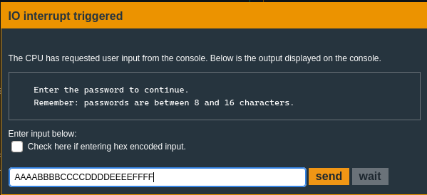  

`c`ontinue until the first breakpoint is hit:  
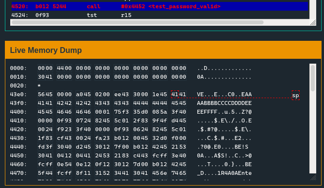  

`c`ontinue until the second breakpoint is hit:  
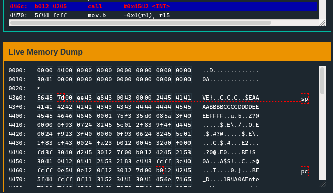  

Step over this breakpoint by using `n`ext instruction.  
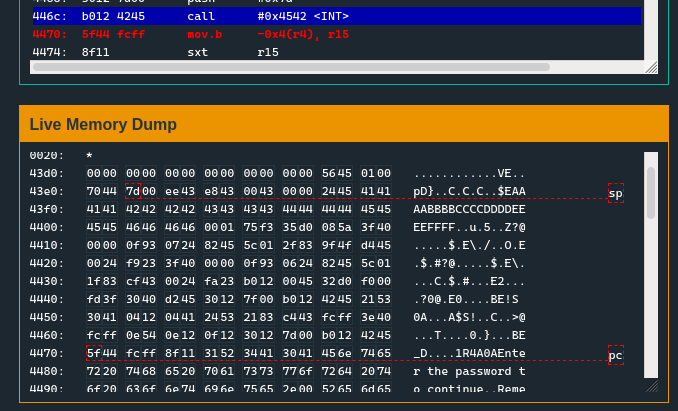  

Continue using `n`ext instruction until you are sitting on the `ret`:  
<table style="width:100%">  
    <tr>
        <td>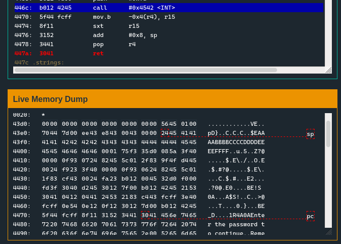</td> <!--Row 1: Left side/Column 1-->
        <td>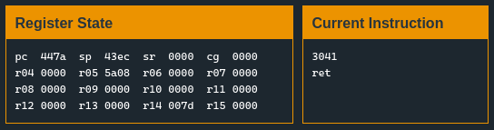</td> <!--Row 1: Right side image/Column 2-->
    </tr>
</table>  

Looking at the `sp`'s **value** shows where we are going to `ret` to.  Why does this matter here?  It doesn't at this moment.. but good habits to get into.  Knowing where you are / going.  
This shows we'll be `ret` to `24 45`, but remember **endianness** so that's `4524`, hit `s`tep and you'll see the `pc` and current instruction is `4524` as expected:  


<table style="width:100%">  
    <tr>
        <td>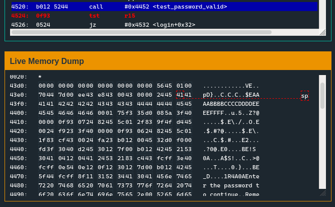</td> <!--Row 1: Left side/Column 1-->
        <td>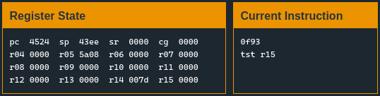</td> <!--Row 1: Right side image/Column 2-->
    </tr>
</table>  

`n`ext instruction, you'll see the `tst` occur, and then get ready to take the `jz` at address `4526`:  
<table style="width:100%">  
    <tr>
        <td>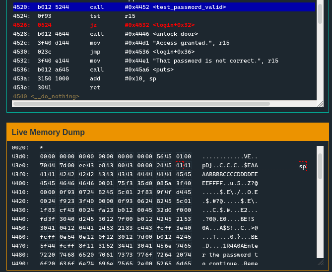</td> <!--Row 1: Left side/Column 1-->
        <td>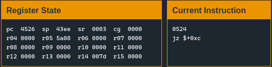</td> <!--Row 1: Right side image/Column 2-->
    </tr>
</table>  

At this point when you hit `n`ext instruction you're going to have this happen:  
<table style="width:100%">  
    <tr>
        <td>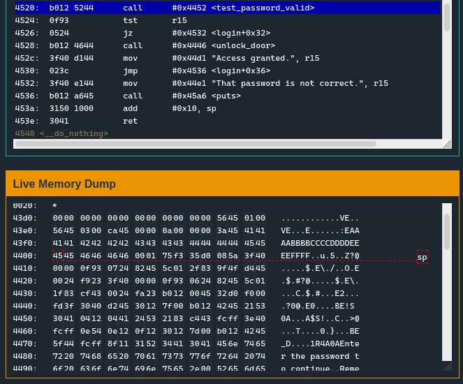</td> <!--Row 1: Left side/Column 1-->
        <td>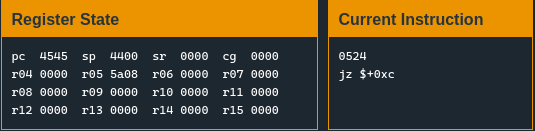</td> <!--Row 1: Right side image/Column 2-->
    </tr>
</table>  

Notice the program counter `pc` is at `0x4545`?  We control EIP.  You can use `s`tep instead of `n`ext instruction if you want to see how it specifically occurs.. but it doesn't matter.. yet.  
So what can we do with this?  Well just redirect the code to right below the `jz`:  
```nasm
4528:  b012 4644      call	#0x4446 <unlock_door>               ; Overflow and JMP to this address
452c:  3f40 d144      mov	#0x44d1 "Access granted.", r15
4530:  023c           jmp	#0x4536 <login+0x36>
```

`reset` the program and this time, swap it to HEX input and enter:  
```
414141414141414141414141414141412845
```

That is **16** `A`'s (0x41) followed by the address `4528`, but in little endian form:  
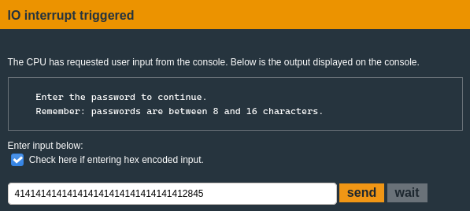  

`solve` the program with that input!
