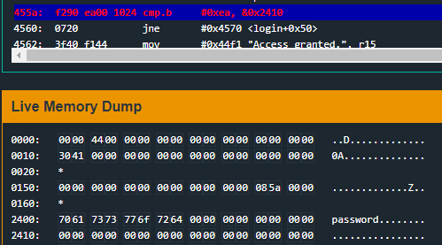
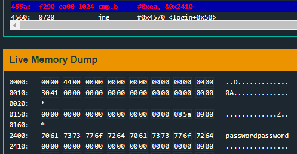
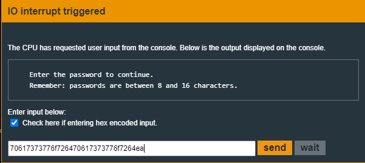
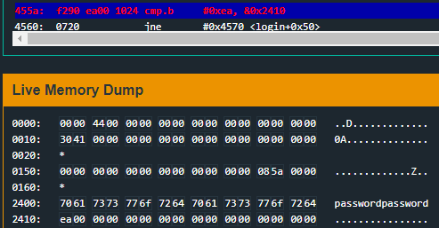

# Hanoi  

In this one, `main` has shifted and instead now calls a `login` function:  
```nasm
4438 <main>
4438:  b012 2045      call	#0x4520 <login>
443c:  0f43           clr	r15
```

```nasm
4520 <login>
4520:  c243 1024      mov.b	#0x0, &0x2410
4524:  3f40 7e44      mov	#0x447e "Enter the password to continue.", r15
4528:  b012 de45      call	#0x45de <puts>
452c:  3f40 9e44      mov	#0x449e "Remember: passwords are between 8 and 16 characters.", r15
4530:  b012 de45      call	#0x45de <puts>
4534:  3e40 1c00      mov	#0x1c, r14
4538:  3f40 0024      mov	#0x2400, r15
453c:  b012 ce45      call	#0x45ce <getsn>
4540:  3f40 0024      mov	#0x2400, r15
4544:  b012 5444      call	#0x4454 <test_password_valid>
4548:  0f93           tst	r15
454a:  0324           jz	$+0x8
454c:  f240 ad00 1024 mov.b	#0xad, &0x2410
4552:  3f40 d344      mov	#0x44d3 "Testing if password is valid.", r15
4556:  b012 de45      call	#0x45de <puts>
455a:  f290 ea00 1024 cmp.b	#0xea, &0x2410
4560:  0720           jne	#0x4570 <login+0x50>
4562:  3f40 f144      mov	#0x44f1 "Access granted.", r15
4566:  b012 de45      call	#0x45de <puts>
456a:  b012 4844      call	#0x4448 <unlock_door>
456e:  3041           ret
4570:  3f40 0145      mov	#0x4501 "That password is not correct.", r15
4574:  b012 de45      call	#0x45de <puts>
4578:  3041           ret
```

There are two parts that are interesting here:  
```nasm
4544:  b012 5444      call	#0x4454 <test_password_valid>
4548:  0f93           tst	r15
454a:  0324           jz	$+0x8
454c:  f240 ad00 1024 mov.b	#0xad, &0x2410
```

and 

```nasm
455a:  f290 ea00 1024 cmp.b	#0xea, &0x2410
4560:  0720           jne	#0x4570 <login+0x50>
...
4570:  3f40 0145      mov	#0x4501 "That password is not correct.", r15
```

The top code chunk seems to run `test_password_valid` and then depending on the value at `r15` it will either `JMP` forward by 8 bytes or `MOV` the hex byte `0xAD` into address `0x2410`.  

But the line that is **key** is `455a`.  
`CMP` the byte value at address `0x2410` with `0xea`, and if NOT equal `JMP` to "That password is not correct".  

There are other things that are interesting, but lets just jump in.  

On initial run the prompt is shown with the following information:  
```
Enter the password to continue.
Remember: passwords are between 8 and 16 characters.
```

But is this.. true or just want the author intends?  


Set a `b`reak on `0x455a` the `CMP`, and run it with the userinput of **password**.  
  
When the breakpoint is hit, you can see that `0x2410` is `0x00`.  Password is 8 characters and only filled up the first half.. so put in a 16 character password such as: `passwordpassword`.  

  

So 16 characters filled up the buffer, or at least what the author wants us to do (8-16 characters), but the offset at address `0x2410` is still `0x00`.. and it needs to be `0xEA`.  

Change the user input to be "hex encoded input" because `0xea` is not an ASCII printable character.  

Copy the hex you see in the screenshot (or enter some alternative hex values such as 0x41 which is A), and then add `ea` at the end of it.  
```
70617373776f726470617373776f7264ea
```

  

This time when the breakpoint is hit:  
  

The value at address `0x2410` is `ea` as it needs to be.  Hit `c`ontinue and then `solve` it.  