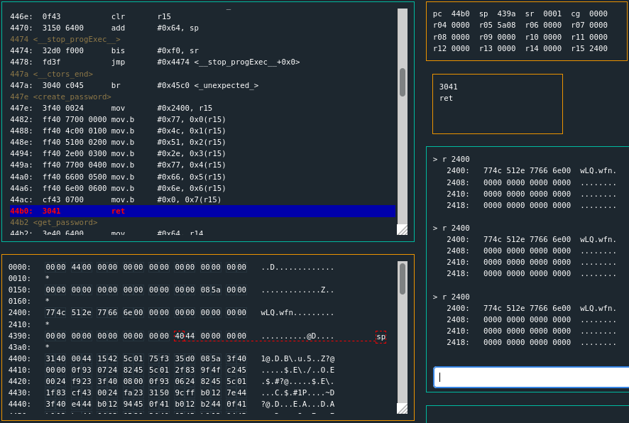
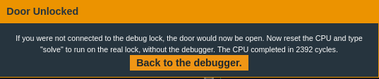

# New Orleans  
```nasm {.line-numbers, highlight=9}
4438 <main>
4438:  3150 9cff      add	#0xff9c, sp
443c:  b012 7e44      call	#0x447e <create_password>
4440:  3f40 e444      mov	#0x44e4 "Enter the password to continue", r15
4444:  b012 9445      call	#0x4594 <puts>
4448:  0f41           mov	sp, r15
444a:  b012 b244      call	#0x44b2 <get_password>
444e:  0f41           mov	sp, r15
4450:  b012 bc44      call	#0x44bc <check_password>
4454:  0f93           tst	r15
4456:  0520           jnz	#0x4462 <main+0x2a>
4458:  3f40 0345      mov	#0x4503 "Invalid password; try again.", r15
445c:  b012 9445      call	#0x4594 <puts>
4460:  063c           jmp	#0x446e <main+0x36>
4462:  3f40 2045      mov	#0x4520 "Access Granted!", r15
4466:  b012 9445      call	#0x4594 <puts>
446a:  b012 d644      call	#0x44d6 <unlock_door>
446e:  0f43           clr	r15
4470:  3150 6400      add	#0x64, sp
```

Line 9 has a similar `check_password` as the previous tutorial, with a simple Test & `JNZ` to success following it.  But notice, at line 3.. `create_password`.  

```nasm {.line-numbers}
447e <create_password>
447e:  3f40 0024      mov	#0x2400, r15
4482:  ff40 7700 0000 mov.b	#0x77, 0x0(r15)
4488:  ff40 4c00 0100 mov.b	#0x4c, 0x1(r15)
448e:  ff40 5100 0200 mov.b	#0x51, 0x2(r15)
4494:  ff40 2e00 0300 mov.b	#0x2e, 0x3(r15)
449a:  ff40 7700 0400 mov.b	#0x77, 0x4(r15)
44a0:  ff40 6600 0500 mov.b	#0x66, 0x5(r15)
44a6:  ff40 6e00 0600 mov.b	#0x6e, 0x6(r15)
44ac:  cf43 0700      mov.b	#0x0, 0x7(r15)
44b0:  3041           ret
```

This looks like ASCII hex codes, so set `break` at `44b0`.  At this `ret` register `r15` should contain the password.  
  
Looking at `r15` it contains the address `2400`.  Look at the address pointed at by `r15` by doing a `r`ead: `r 2400`.  

```
2400:   774c 512e 7766 6e00 0000 0000 0000 0000   wLQ.wfn.........
```
The password is: `wLQ.wfn`.  



Run `solve` and use the valid password.  

