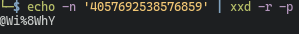
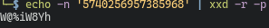

# Sydney  

```nasm {.line-numbers}
4438 <main>
4438:  3150 9cff      add	#0xff9c, sp
443c:  3f40 b444      mov	#0x44b4 "Enter the password to continue.", r15
4440:  b012 6645      call	#0x4566 <puts>
4444:  0f41           mov	sp, r15
4446:  b012 8044      call	#0x4480 <get_password>
444a:  0f41           mov	sp, r15
444c:  b012 8a44      call	#0x448a <check_password>
4450:  0f93           tst	r15
4452:  0520           jnz	#0x445e <main+0x26>
4454:  3f40 d444      mov	#0x44d4 "Invalid password; try again.", r15
4458:  b012 6645      call	#0x4566 <puts>
445c:  093c           jmp	#0x4470 <main+0x38>
445e:  3f40 f144      mov	#0x44f1 "Access Granted!", r15
4462:  b012 6645      call	#0x4566 <puts>
4466:  3012 7f00      push	#0x7f
446a:  b012 0245      call	#0x4502 <INT>
446e:  2153           incd	sp
4470:  0f43           clr	r15
4472:  3150 6400      add	#0x64, sp
```

Similar to previous tutorial and new orleans, a check_password function followed by a Test & `JNZ` and if non-zero then access is granted.  

The `check_password` function this time is more intricate:  
```nasm {.line-numbers, highlight=[2,4,6,9]}
448a <check_password>
448a:  bf90 5740 0000 cmp	#0x4057, 0x0(r15)
4490:  0d20           jnz	$+0x1c
4492:  bf90 2569 0200 cmp	#0x6925, 0x2(r15)
4498:  0920           jnz	$+0x14
449a:  bf90 5738 0400 cmp	#0x3857, 0x4(r15)
44a0:  0520           jne	#0x44ac <check_password+0x22>
44a2:  1e43           mov	#0x1, r14
44a4:  bf90 5968 0600 cmp	#0x6859, 0x6(r15)
44aa:  0124           jeq	#0x44ae <check_password+0x24>
44ac:  0e43           clr	r14
44ae:  0f4e           mov	r14, r15
44b0:  3041           ret
```

Lines 2,4,6,9 have hard coded ASCII values.  The `CMP` shown is every 2 bytes, so still looping through the string input, but instead of `inc`rementing like previously seen, it checks every 2 bytes.  

So the expected hex string should be:  
```
4057692538576859
```

Bash can solve this quickly by using `xxd`:
```bash
echo -n '4057692538576859' | xxd -r -p
```
or you can look up an ASCII table.  
  

## The Gotcha: Endianness
The string makes sense.. but it needs to be placed as little endian.  So every two bytes, needs to be reversed.  Instead of `0x4057` which is `@W`.. it should be input as `W@`.  

So instead of `4057692538576859` it should be: 
```
5740
2569
5738
5968
```
Chunks of 4 to keep it readable.  

`echo -n '5740256957385968' | xxd -r -p`
  

The password is: `W@%iW8Yh`  
  

Solve and continue on