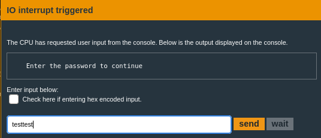
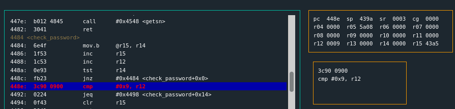
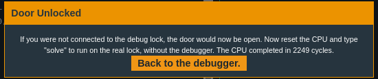

# Tutorial  
```{.line-numbers, .highlight=8}
4438 <main>
4438:  3150 9cff      add	#0xff9c, sp
443c:  3f40 a844      mov	#0x44a8 "Enter the password to continue", r15
4440:  b012 5845      call	#0x4558 <puts>
4444:  0f41           mov	sp, r15
4446:  b012 7a44      call	#0x447a <get_password>
444a:  0f41           mov	sp, r15
444c:  b012 8444      call	#0x4484 <check_password>
4450:  0f93           tst	r15
4452:  0520           jnz	#0x445e <main+0x26>
4454:  3f40 c744      mov	#0x44c7 "Invalid password; try again.", r15
4458:  b012 5845      call	#0x4558 <puts>
445c:  063c           jmp	#0x446a <main+0x32>
445e:  3f40 e444      mov	#0x44e4 "Access Granted!", r15
4462:  b012 5845      call	#0x4558 <puts>
4466:  b012 9c44      call	#0x449c <unlock_door>
446a:  0f43           clr	r15
446c:  3150 6400      add	#0x64, sp
```

Line 8 calls `check_password` with a test after.  The test is checking for a non-zero return via `jnz` to go to "Access Granted".  

```nasm {.line-numbers, .highlight=7}
4484 <check_password>
4484:  6e4f           mov.b	@r15, r14
4486:  1f53           inc	r15
4488:  1c53           inc	r12
448a:  0e93           tst	r14
448c:  fb23           jnz	#0x4484 <check_password+0x0>
448e:  3c90 0900      cmp	#0x9, r12
4492:  0224           jeq	#0x4498 <check_password+0x14>
4494:  0f43           clr	r15
4496:  3041           ret
4498:  1f43           mov	#0x1, r15
449a:  3041           ret
```

Line 7 shows a comparison of **0x9** against the `r12` register.  The entire block before is what looks like a loop through an array, character by character.  There doesn't seem to be any comparison against a string, just a length.  In that case use the password `testtest` which is 8 characters.  Any string passed in is always null terminated (0x0) so a string of 8 characters.. is actually 9.  

Set a break on this `CMP`:  
```nasm
break 448e
```

`c`ontinue until this is hit:  
  

Notice that r12 is 0x9.  The comparison is valid then.  Continue.  
  

This works.  
  

So enter `solve` and finish this. 