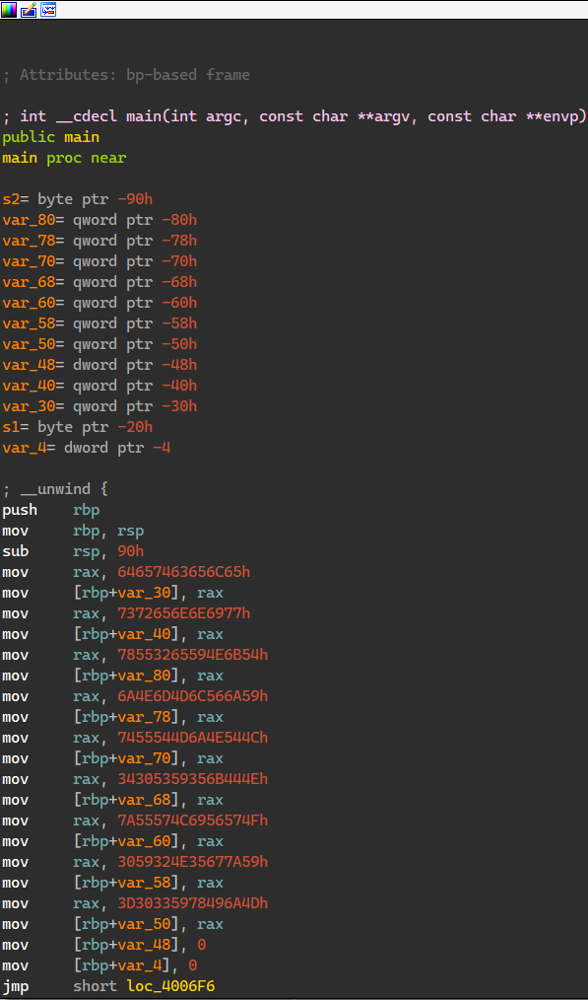
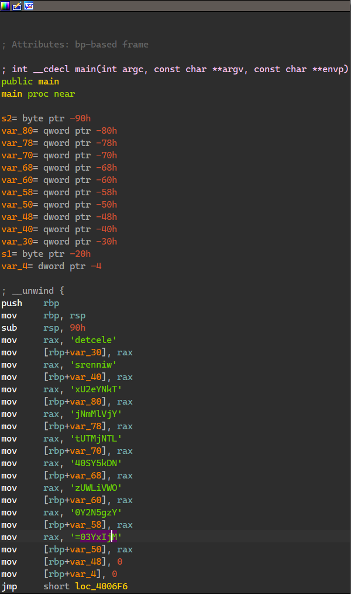
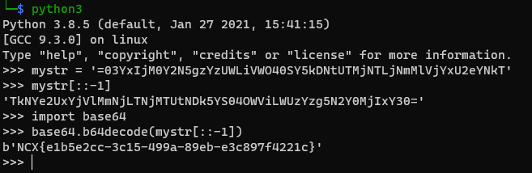
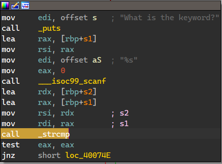
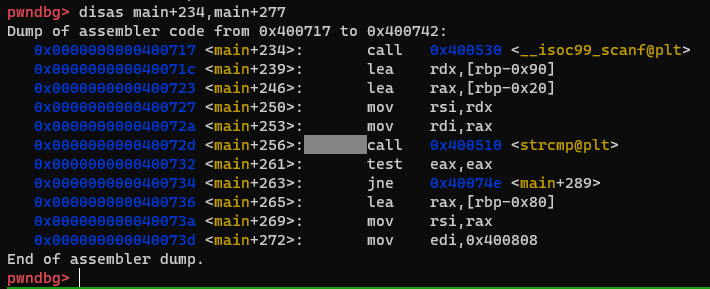
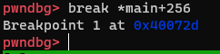
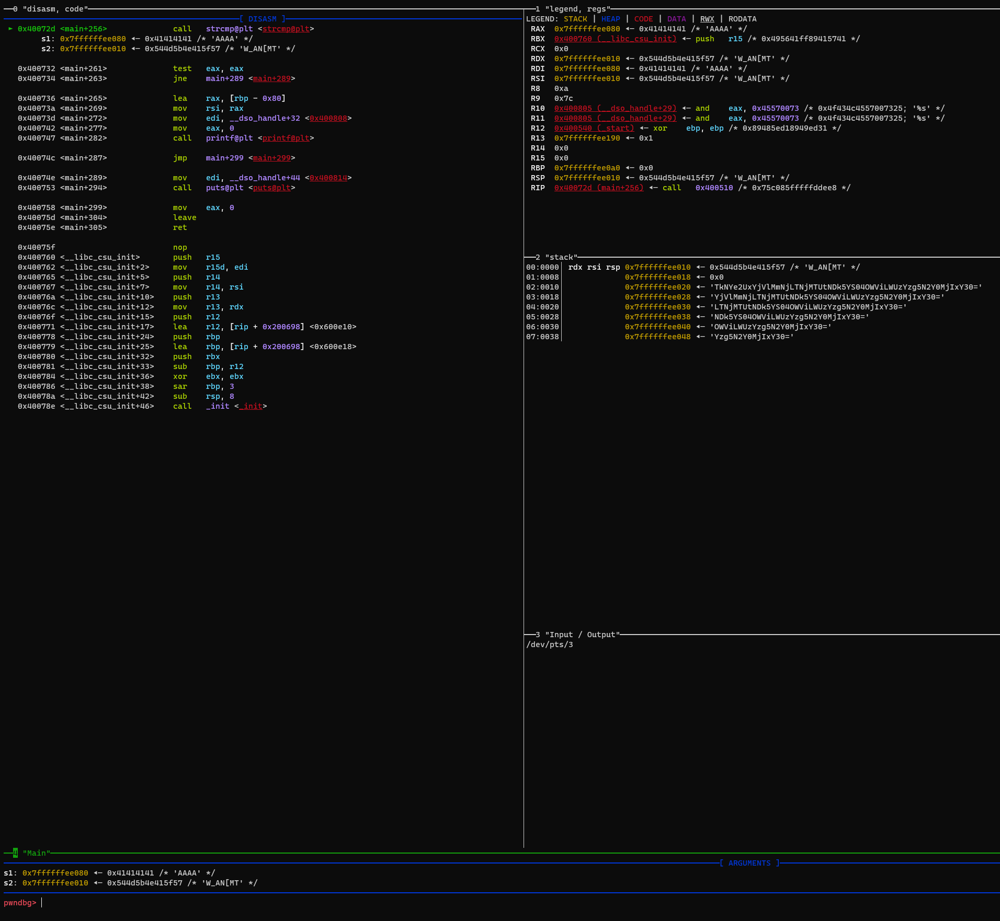
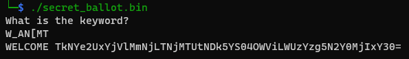
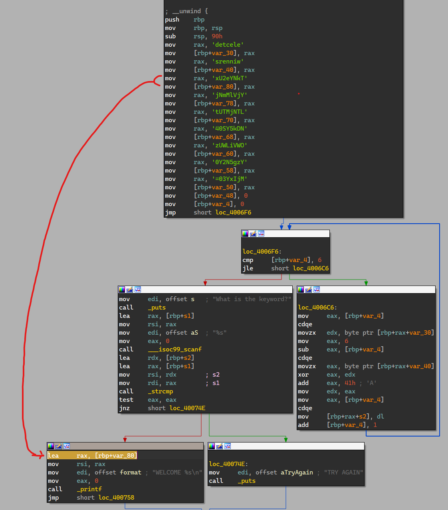

# secret_ballot

# Static Analysis

<table style="width:100%">
    <tr>
        <td><center>Before (Hex)</center></td>
        <td><center>After (Hex -> ASCII)</center></td>
    </tr>
    <tr>
        <td></td>
        <td></td>
    </tr>
</table>

```plain
64657463656C65h     --> detcele
7372656E6E6977h     --> srenniw
78553265594E6B54h   --> xU2eYNkT
6A4E6D4D6C566A59h   --> jNmMlVjY
7455544D6A4E544Ch   --> tUTMjNTL
34305359356B444Eh   --> 40SY5kDN
7A55574C6956574Fh   --> zUWLiVWO
3059324E35677A59h   --> 0Y2N5gzY
3D30335978496A4Dh   --> =03YxIjM
```

This shows the plain text string being built via `MOV` instructions.  "elected winners" is clear to read, but the next part isn't, however the final line has an equal sign `=`, so possibly base64:  

Using python3 to rebuild this:  
```python
mystr = '=03YxIjM0Y2N5gzYzUWLiVWO40SY5kDNtUTMjNTLjNmMlVjYxU2eYNkT'
mystr[::-1]  # Reverse the string
'TkNYe2UxYjVlMmNjLTNjMTUtNDk5YS04OWViLWUzYzg5N2Y0MjIxY30=' 
import base64  # Use the python library
base64.b64decode(mystr[::-1])
b'NCX{e1b5e2cc-3c15-499a-89eb-e3c897f4221c}'
```

  


# Dynamic  
Instead of manually solving this, if you look at the breakdown in GDB, IDA, etc, you can find a `strcmp` which is the fast solution:  

The **MSDN** for strcmp is:  
```c
// https://docs.microsoft.com/en-us/cpp/c-runtime-library/reference/strcmp-wcscmp-mbscmp?view=msvc-160
int strcmp(
   const char *string1,
   const char *string2
);
```

### IDA  
  

### GDB (with pwndbg)  

```bash
disas main
break *main+256
```

This slice is so the `strcmp` will fit nicely in a screenshot using GDB:
  

IDA labels it for you already, but `RDI` is going to be `string1` and `RSI` is `string2`, set a breakpoint and view:

  


Run this program so it hits the breakpoint, when prompted enter any string such as "AAAA":  
  


The string being compared is our input (string1) "AAAA" against the keyword "W_AN[MT".  Also notice the base64 string a little further down from `RSP`:  
```plain
TkNYe2UxYjVlMmNjLTNjMTUtNDk5YS04OWViLWUzYzg5N2Y0MjIxY30=

Taking this from Base64 makes it: 
NCX{e1b5e2cc-3c15-499a-89eb-e3c897f4221c}
```
We already know what that is.  But for shits and grins re-run the program using the keyword `W_AN[MT` as input when prompted:  
  

This picture shows that if you're successful with the keyword then print what's at offset `[rbp+var_80]`, which according to the arrow below, is the start of the base64 string.  This will continue until it hits a 0 or null terminator:  
  
