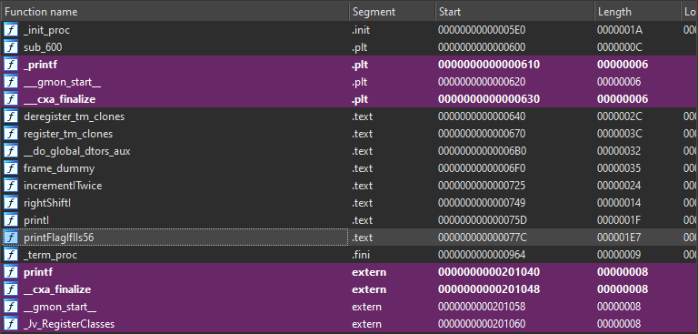

# shared_flag

# Static Analysis  

Opening this up in IDA shows very few functions:  
  

Interestingly enough, there is a `printFlagIfIIs56`.  

Scrolling down in this function shows a print formatted flag:  
  

  

Since this is a shared object (.so), and on linux.. we don't have access to rundll32.exe like on Windows.  Instead, Linux has a function called `dlopen` ( https://linux.die.net/man/3/dlopen ).  

Write up a quick C wrapper to be able to debug this easier:  
```c
// shared.c
//
// Reference: `dlopen` ( https://linux.die.net/man/3/dlopen )
// Reference: https://github.com/cirosantilli/cpp-cheat/blob/81ab30c55634db24216e89ada1e0f271cac074e7/shared-library/basic/dlopen.c

#include <stdio.h>
#include <stdlib.h>
#include <dlfcn.h>

int
main(int argc, char **argv)
{
    void *handle;
    int (*flag)(void);  // Create a void (int?) function pointer place holder called flag
    char *error;

   handle = dlopen("./shared_flag.so", RTLD_LAZY);  // Create a handle to the shared object file
    if (!handle) {
        fprintf(stderr, "%s\n", dlerror());
        exit(EXIT_FAILURE);
    }

   dlerror();    /* Clear any existing error */

   flag = (int (*)(void)) dlsym(handle, "printFlagIfIIs56");    // Load the exported function into the flag placeholder

   if ((error = dlerror()) != NULL)  {
        fprintf(stderr, "%s\n", error);
        exit(EXIT_FAILURE);
    }

    flag(); // Call the exported function
    dlclose(handle);
    exit(EXIT_SUCCESS);
}
```

Compile this using `gcc`:  
```bash
# Create a file called shared_flag_c from the c file "shared.c"
gcc -rdynamic -o shared_flag_c shared.c -ldl
```

Using `disas main` inside gdb, scroll down to where dlclose is, since that's right after the call to `flag`:  
  

Notice at `main+181` there is a `call rax`.  This is the function call to `flag()`.  Set a breakpoint on this and then run the program:  
```bash
break *main+181
```
  

The library was successfully loaded and the function identified.  Now **s**tep into this function
```bash
s
```
  

Using either GDB or IDA, notice there is a single spot where this function can 'bail' out:  
*Quick note: pwndbg uses unicorn engine, so the `disasm, code` section shows that it already will fail the cmp and jmp, which is NOT what we want*  

```bash
0x7fffff380796 <printFlagIfIIs56+26>     cmp    eax, 0x38
```

  

Need to ensure this `CMP` passess successfully.  Either set a breakpoint on that `cmp` or `s`tep down to it:  
  

Cheat a little here, and using GDB, set RAX to 0x38:  
```bash
set $rax = 0x38
```
  

Notice that the instructions have changed (love unicorn/pwndbg):  
  

Next, set a breakpoint on the `printf` function so you can let this program print the flag for you, with correct formatting, instead of doing it manually:  
> From the current instruction `$rip`, e`x`amine (print) the next 112 `i`nstructions  

```bash
x/112i $rip
```

  

Set a `b`reakpoint on `*printFlagIfIIs56+464`:  
  

  

Now `s`tep over this `printf` call and the flag is built!  

  

```plain
RSI  0x80058b0 ◂— 'NCX{ae92c70b-2949-4b89-d285-1183336f8d2e}\n'
```