# The Art of Unpacking  
> Author: Mark Vincent Yason  
> Presented at Blackhat, 2007  
> https://www.blackhat.com/presentations/bh-usa-07/Yason/Whitepaper/bh-usa-07-yason-WP.pdf  

*PDF converted to Markdown*  

# Table of Contents  
- [1.  Introduction](#1-introduction)
- [2.  Techniques: Debugger Detection](#2-techniques-debugger-detection)
  - [2.1.  PEB.BeingDebugged Flag: IsDebuggerPresent()](#21-pebbeingdebugged-flag-isdebuggerpresent)
  - [2.2.  PEB.NtGlobalFlag, Heap Flags](#22-pebntglobalflag-heap-flags)
  - [2.3.  DebugPort: CheckRemoteDebuggerPresent() / NtQueryInformationProcess()](#23-debugport-checkremotedebuggerpresent-ntqueryinformationprocess)
  - [2.4.  Debugger Interrupts](#24-debugger-interrupts)
  - [2.5.  Timing Checks](#25-timing-checks)
  - [2.6. SeDebugPrivilege](#26-sedebugprivilege)
  - [2.7.  Parent Process](#27-parent-process)
  - [2.8.  DebugObject: NtQueryObject()](#28-debugobject-ntqueryobject)
  - [2.9.  Debugger Window](#29-debugger-window)
  - [2.10.  Debugger Process](#210-debugger-process)
  - [2.11.  Device Drivers](#211-device-drivers)
  - [2.12.  OllyDbg: Guard Pages](#212-ollydbg-guard-pages)
- [3.  Techniques: Breakpoint and Patching Detection](#3-techniques-breakpoint-and-patching-detection)
- [3.1.  Software Breakpoint Detection](#31-software-breakpoint-detection)
- [3.2. Hardware Breakpoint Detection](#32-hardware-breakpoint-detection)
  - [3.3.  Patching Detection via Code Checksum Calculation](#33-patching-detection-via-code-checksum-calculation)
- [4.  Techniques: Anti-Analysis](#4-techniques-anti-analysis)
  - [4.1.  Encryption and Compression](#41-encryption-and-compression)
  - [4.2. Garbage Code and Code Permutation](#42-garbage-code-and-code-permutation)
  - [4.3.  Anti-Disassembly](#43-anti-disassembly)
- [5.  Techniques: Debugger Attacks](#5-techniques-debugger-attacks)
  - [5.1.  Misdirection and Stopping Execution via Exceptions](#51-misdirection-and-stopping-execution-via-exceptions)
  - [5.2.  Blocking Input](#52-blocking-input)
  - [5.3.  ThreadHideFromDebugger](#53-threadhidefromdebugger)
  - [5.4.  Disabling Breakpoints](#54-disabling-breakpoints)
  - [5.5.  Unhandled Exception Filter](#55-unhandled-exception-filter)
  - [5.6.  OllyDbg: OutputDebugString() Format String Bug](#56-ollydbg-outputdebugstring-format-string-bug)
- [6.  Techniques: Advanced and Other Techniques](#6-techniques-advanced-and-other-techniques)
  - [6.1.  Process Injection](#61-process-injection)
  - [6.2.  Debugger Blocker](#62-debugger-blocker)
  - [6.3.  TLS Callbacks](#63-tls-callbacks)
  - [6.4.  Stolen Bytes](#64-stolen-bytes)
  - [6.5.  API Redirection](#65-api-redirection)
  - [6.6.  Multi-Threaded Packers](#66-multi-threaded-packers)
  - [6.7.  Virtual Machines](#67-virtual-machines)
- [7.  Tools](#7-tools)
  - [7.1.  OllyDbg](#71-ollydbg)
  - [7.2.  Ollyscript](#72-ollyscript)
  - [7.3.  Olly Advanced](#73-olly-advanced)
  - [7.4.  OllyDump](#74-ollydump)
  - [7.5.  ImpRec](#75-imprec)
- [8.  References](#8-references)

<!-- /code_chunk_output -->


# 1.  Introduction  
In the reverse engineering field, packers are one of the most interesting puzzles to solve. In the process of solving these puzzles, the reverser gains more knowledge about a lot of things such operating system internals, reversing tricks, tools and techniques.  

Packers (the term used in this paper for both compressors and protectors) are created toprotect an executable from analysis. They are used legitimately by commercial applications toprevent information disclosure, tampering and piracy. Unfortunately, malcodes also usepackers for the same reasons but for a malicious purpose.  

Due to a large number of packed malcode, researchers and malcode analysts started todevelop the skills to unpack samples for analysis. However, as time goes by, new anti-reversing techniques are constantly added into packers to prevent reversers from analyzingthe protected executable and preventing a successful unpack. And the cycle goes on - newanti-reversing techniques are developed while reversers on the other side of the fence developthe skills, techniques, and tools to defeat them.  

The main focus of this paper is to present anti-reversing techniques employed by packers,tools and techniques on how to bypass/disable these protections are also discussed.Conversely, some packers can easily be bypassed by process dumping and thus, dealing withanti-reversing techniques seems unnecessary. However, there are instances where theprotector code needed to be traced and analyzed, such as:  
* Parts of the protector code needed to be bypassed in order for a process dumpingand import table rebuilding tool to properly work
* In-depth analysis of a protector code in order to integrate unpacking support into an AV product

Additionally, understanding anti-reversing techniques is also valuable in cases where they aredirectly applied to a malcode in order prevent tracing and analysis of their malicious routines.  

This paper is by no means contain a complete list of anti-reversing techniques as it onlycovers the commonly used and interesting techniques found in packers. The reader is advisedto refer to the last section which contains links and books information to learn more aboutother anti-reversing and reversing techniques.  

The author hopes that the reader found this material useful and able to apply the tips, tricksand techniques presented. Happy Unpacking!


# 2.  Techniques: Debugger Detection  
This section lists the techniques used by packers to determine if the process is being debugged, or if a debugger is running in the system.  These debugger detection techniques range from the very simple (and obvious) checks to the one that deals with native APIs and kernel objects.  


## 2.1.  PEB.BeingDebugged Flag: IsDebuggerPresent()  
The most basic debugger detection technique involves checking the BeingDebugged flag in the Process Environment Block (`PEB`)<sup>1</sup>. The `kernel32!IsDebuggerPresent()` API checks the value of this flag to identify if the process is being debugged by a user-mode debugger.  

The code below shows the actual implementation of the `IsDebuggerPresent()` API. It accesses the Thread Environment Block (`TEB`)<sup>2</sup> in order to get the address of PEB, and then checks the  BeingDebugged flag at offset `0x02` of the `PEB`.  

```nasm
mov     eax, large fs:18h
mov     eax, [eax+30h]
movzx   eax, byte ptr [eax+2]
retn
```

Instead of calling `IsDebuggerPresent()`, some packers manually checks the PEB for the BeingDebugged flag, this is in case a reverser sets a breakpoint or patch the said API.  

***Example***
Below is an example code for identifying if a debugger is present using the `IsDebuggerPresent()` API and the `PEB.BeingDebugged` flag:  
```nasm
; call kernel32!IsDebuggerPresent()
call    [IsDebuggerPresent]
test    eax,eax
jnz     .debugger_found

; check PEB.BeingDebugged directly
mov     eax,dword [fs:0x30] ; EAX = TEB.ProcessEnvironmentBlock
movzx   eax,byte [eax+0x02] ; AL  = PEB.BeingDebugged
test    eax,eax
jnz     .debugger_found
```
Since these checks are very obvious, packers obfuscate them by using garbage codes or anti-disassembly techniques discussed in later sections.  

***Solution***
This technique can be easily bypassed by manually patching the `PEB.BeingDebugged` flag with the byte value of `0x00`.  To view the PEB in OllyDbg, in the data window, press Ctrl+G (Goto Expression), type `fs:[30]`.

Additionally, the Ollyscript<sup>3</sup> command `dbh` patches the said byte:  
```nasm
dbh
```

Finally, the Olly Advanced<sup>3</sup> plugin has on option to set the BeingDebugged field to 0.

<sup>1</sup> - Data type of the PEB structure is _PEB which can be viewed in WinDbg using the `dt` command  
<sup>2</sup> - Data type of the TEB structure is _TEB  
<sup>3</sup> - See the TOOLS section for more information about these tools  


## 2.2.  PEB.NtGlobalFlag, Heap Flags  
**PEB.NtGlobalFlag**. The PEB has another field called NtGlobalFlag (offset 0x68) which packers also use to detect if a program had been loaded by a debugger. Normally, when a process is not being debugged, the NtGlobalFlag field contains the value 0x0, however, if the process is being debugged, the said field will usually contain the value 0x70 which signifies the following flags are set:  
* FLG_HEAP_ENABLE_TAIL_CHECK (0x10)  
* FLG_HEAP_ENABLE_FREE_CHECK (0x20)  
* FLG_HEAP_VALIDATE_PARAMETERS (0x40)  

These flag are set inside the ntdll!LdrpInitializeExecutionOptions(). Note that the default value of PEB.NtGlobalFlag can be overridden using the gflags.exe tool or by creating an entry in the following registry key:  
```powershell
HKLM\Software\Microsoft\Windows NT\CurrentVersion\Image File Execution Options
```

**Heap Flags**.  Due to the flags set in NtGlobalFlag, heaps that are created will have several flags turned on, and that this behavior can be observed inside ntdll!RtlCreateHeap(). Typically, the initial heap created for the process (PEB.ProcessHeap) will have its Flags and ForceFlags fields<sup>4</sup> set to 0x02 (HEAP_GROWABLE) and 0x0 respectively. However, when a process is being debugged, these flags are usually set to 0x50000062 (depending on the NtGlobalFlag) and 0x40000060 (which is Flags AND 0x6001007D). By default, the following additional heap flags are set when a heap is created on a debugged process:  
* HEAP_TAIL_CHECKING_ENABLED (0x20)  
* HEAP_FREE_CHECKING_ENABLED (0x40)  

***Example***
The example code below checks if PEB.NtGlobalFlag is not equal to 0, and if additional flags are set PEB.ProcessHeap:  
```nasm
; ebx = PEB
mov     ebx,[fs:0x30]

; Check if PEB.NtGlobalFlag != 0
cmp dword [ebx+0x68],0
jne     .debugger_found

; eax = PEB.ProcessHeap
mov     eax,[ebx+0x18]

; Check PEB.ProcessHeap.Flags
cmp     dword [eax+0x0c],2
jne     .debugger_found

; Check PEB.ProcessHeap.ForceFlags
cmp     dword [eax+0x10],0
jne     .debugger_found
```

***Solution***
The solution is to patch PEB.NtGlobalFlag and PEB.HeapProcess flags to their corresponding values as if the process is not being debugged. The following is an example ollyscript to patch the said flags:  
```cpp 
var     peb
var     patch_addr
var     process_heap

// retrieve PEB via a hardcoded TEB address (first thread: 0x7ffde000)
mov     peb,[7ffde000+30]

// patch PEB.NtGlobalFlag
lea     patch_addr,[peb+68]
mov     [patch_addr],0

// patch PEB.ProcessHeap.Flags/ForceFlags
mov     process_heap,[peb+18]
lea     patch_addr,[process_heap+0c]
mov     [patch_addr],2
lea     patch_addr,[process_heap+10]
mov     [patch_addr],0
```
Also, the Olly Advanced plugin has on option to set PEB.NtGlobalFlags and the PEB.ProcessHeap flags.  
<sup>4</sup> - Data type for the heap structure is _HEAP  


## 2.3.  DebugPort: CheckRemoteDebuggerPresent() / NtQueryInformationProcess()  
Kernel32!CheckRemoteDebuggerPresent() is another API which can be used to determine if a debugger is attached to the process. This API internally invokes ntdll! NtQueryInformationProcess() with the ProcessInformationClass parameter set to ProcessDebugPort (7). Furthermore, inside the kernel, NtQueryInformationProcess() queries the DebugPort field of the EPROCESS5  kernel structure. A non-zero value in the DebugPort field indicates that the process is being debugged by user-mode debugger, if that is the case, ProcessInformation will be set with the value 0xFFFFFFFF, otherwise, ProcessInformation will be set with the value 0x0. 

Kernel32!CheckRemoteDebuggerPresent() accepts 2 parameters, the first parameter is the process handle and the second parameter is a pointer to a boolean variable that will contain a TRUE value if the process is being debugged.  
```cpp
BOOL CheckRemoteDebuggerPresent (
    HANDLE hProcess,
    PBOOL pbDebuggerPresent
)

```
Ntdll!NtQueryInformationProcess() on the other hand, have 5 parameters. For the purpose of detecting a debugger, the ProcessInformationClass is set to ProcessDebugPort (7):  
```cpp
NTSTATUS NTAPI NtQueryInformationProcess (
    HANDLE ProcessHandle,
    PROCESSINFOCLASS ProcessInformationClass,
    PVOID ProcessInformation,
    ULONG ProcessInformationLength,
    PULONG ReturnLength
)
```

***Example***
The example below shows a typical call to CheckRemoteDebuggerPresent() and NtQueryInformationProcess () to detect if the current process is being debugged:  
```nasm
; using kernel32!CheckRemoteDebuggerPresent()
lea     eax,[.bDebuggerPresent]
push    eax                             ; pbDebuggerPresent
push    0xffffffff                      ; hProcess
call    [CheckRemoteDebuggerPresent]
cmp     dword [.bDebuggerPresent],0
jne     .debugger_found

; using ntdll!NtQueryInformationProcess(ProcessDebugPort)
lea     eax,[.dwReturnLen]
push    eax                             ; ReturnLength
push    4                               ; ProcessInformationLength
lea     eax,[.dwDebugPort]
push    eax                             ; ProcessInformation
push    ProcessDebugPort                ; ProcessInformationClass (7)
push    0xffffffff                      ; ProcessHandle
call    [NtQueryInformationProcess]
cmp     dword [.dwDebugPort],0
jne     .debugger_found
```
***Solution***  
One solution involves setting a breakpoint where NtQueryInformationProcess() returns, then when the breakpoint is hit, ProcessInformation is patched with a DWORD value 0. An example ollyscript to perform this automatically is shown below:  
```cpp
    var bp_NtQueryInformationProcess

    // set a breakpoint handler
    eob bp_handler_NtQueryInformationProcess

    // set a breakpoint where NtQueryInformationProcess returns
    gpa "NtQueryInformationProcess", "ntdll.dll"
    find $RESULT, #C21400# //retn 14
    mov bp_NtQueryInformationProcess,$RESULT
    bphws bp_NtQueryInformationProcess,"x"
    run

bp_handler_NtQueryInformationProcess:
    //ProcessInformationClass == ProcessDebugPort?
    cmp [esp+8], 7
    jne bp_handler_NtQueryInformationProcess_continue

    //patch ProcessInformation to 0
    mov patch_addr, [esp+c]
    mov [patch_addr], 0

    //clear breakpoint
    bphwc bp_NtQueryInformationProcess

bp_handler_NtQueryInformationProcess_continue:
    run
```

The Olly Advanced plugin has an option to patch NtQueryInformationProcess(). The patch involves injecting a code that will manipulate the return value of NtQueryInformationProcess().  


## 2.4.  Debugger Interrupts  
This technique uses the fact that when the interrupt instructions INT3 (breakpoint) and INT1 (single-step) are stepped thru inside a debugger, by default, the exception handler will not be invoked since debuggers typically handle the exceptions generated by these interrupts. Thus, a packer can set flags inside the exception handler, and if these flags are not set after the INT instruction, it means that the process is being debugged. Additionally, kernel32!DebugBreak() internally invokes an INT3 and some packers use the said API instead.  

***Example***
This example sets the value of EAX to 0xFFFFFFFF (via the CONTEXT<sup>6</sup> record) while inside exception handler to signify that the exception handler had been called:  
```nasm
    ; set exception handler
    push    .exception_handler
    push    dword [fs:0]
    mov     [fs:0], esp

    ; reset flag (EAX) invoke int3
    xor     eax,eax
    int3

    ; restore exception handler
    pop     dword [fs:0]
    add     esp,4

    ; check if the flag had been set
    test    eax,eax
    je      .debugger_found

:::

.exception_handler:
    ; EAX = ContextRecord
    mov     eax,[esp+0xc]
    ; set flag (ContextRecord.EAX)
    mov     dword [eax+0xb0],0xffffffff
    ; set ContextRecord.EIP
    inc     dword [eax+0xb8]
    xor     eax,eax
    retn
```

***Solution***  
In OllyDbg, while stepping thru or execution had stopped due to a debugger interrupt, identify the exception handler address (via View -> SEH Chain) and then set a breakpoint on the exception handler. Then, press Shift+F9 so that the single-step/breakpoint exception generated by these interrupts is passed to the exception handler. The breakpoint will eventually be hit and the exception handler can be traced.  

Another solution is to allow single- step/breakpoint exceptions to be  automatically passed to the exception handler. This can be set in OllyDbg via Options -> Debugging Options -> Exceptions -> “Ignore following exceptions” and then check the “INT 3 breaks” and “Single-step break” check boxes.  
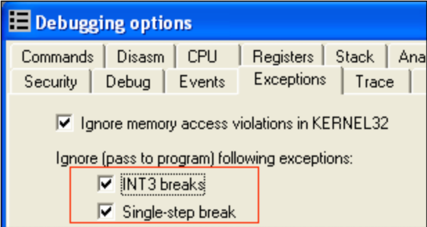 


## 2.5.  Timing Checks  
When a process is being debugged, several CPU cycles are spent by the debugger event handling code, a reverser stepping thru the instructions, etc. Packers takes advantage of this by determining the time spent between several instructions, if the time spent took longer compared to a normal run, it probably means that the process is being executed under a debugger.  

***Example***
Below is a simple example of a timing check. It uses the RDTSC (Read Time-Stamp Counter) instruction before and after several instructions, and then computes the delta. The delta value of 0x200 depends on how much code is executed between the two RDTSC instructions.  

```nasm
rdtsc
mov     ecx,eax
mov     ebx,edx

; ... more instructions
nop
push    eax
pop     eax
nop
; ... more instructions

; compute delta between RDTSC instructions
rdtsc

; Check high order bits
cmp     edx,ebx
ja      .debugger_found

; Check low order bits
sub     eax,ecx
cmp     eax,0x200
ja      .debugger_found
```

Variations of timing checks includes using the API kernel32!GetTickCount(), or manually checking the value of the TickCountLow and TickCountMultiplier fields of the SharedUserData<sup>7</sup> data structure which is always located at the address 0xc.  

These timing techniques, specially using RDTSC can be difficult to identify if garbage codes and other obfuscation techniques attempts to hide them.  

***Solution***  
One solution would be to identify where the timing checks are and then avoiding stepping thru code in between these timing checks. The reverser can just set a breakpoint just before the delta comparison and then perform a Run instead of a Step until the breakpoint is hit. Additionally, a breakpoint can be set in GetTickCount() to determine where it had been called or to modify its return value. 

Olly Advanced has another solution - It installs a kernel mode driver that does the following:  
1.  Sets that Time Stamp Disable Bit (TSD) in control register CR4<sup>8</sup>  . When the said bit is set and if the RDTSC instruction is executed in a privilege level other than 0, a General Protection (GP) exception will be triggered.  
2.  The Interrupt Descriptor Table (IDT) is set up so that the GP exception is hooked and execution of RTDSC is filtered. If the GP is because of an RDTSC instruction, just increment the returned timestamp from the previous call by 1.  

It should be noted that the discussed driver may cause instability to the system, thus, experimenting with this feature should always be done on a non-production machine or in a virtual machine.  

<sup>7</sup> - Data type of SharedUserData is _KUSER_SHARED_DATA
<sup>8</sup> - See “Control Registers” in IA-32 Intel® Architecture Software Developer's Manual Volume 3A: System Programming Guide, Part 1


## 2.6. SeDebugPrivilege  
By default, a process has the SeDebugPrivilege privilege in their access token disabled. However, when the process is loaded by a debugger such as OllyDbg and WinDbg, the SeDebugPrivilege privilege is enabled. This is the case since these debuggers attempt to adjust their token to enable the said privilege and when the debugged process is loaded, the SeDebugPrivilege privilege is inherited. 

Some packers indirectly use SeDebugPrivilege to identify if the process is being debugged by attempting to open the CSRSS.EXE process. If a process is able to open the CSRSS.EXE process; it means that the process has the SeDebugPrivilege privilege enabled in the access token, and thus, suggesting that the process is being debugged. This check works because the security descriptor of the CSRSS.EXE process only allows SYSTEM to access the said process, but if a process has the SeDebugPrivilege privilege; it can access another process regardless of the security descriptor<sup>9</sup>.  Note that this privilege is only granted to members of the Administrators group by default.  

***Example***
An example check is shown below:  
```nasm
    ; query for the PID of CSRSS.EXE
    call    [CsrGetProcessId]

    ; try to open the CSRSS.EXE process
    push    eax
    push    FALSE
    push    PROCESS_QUERY_INFORMATION
    call    [OpenProcess]

    ; if OpenProcess() was successful,
    ; process is probably being debugged
    test    eax,eax
    jnz     .debugger_found
```

This check uses the API ntdll!CsrGetProcessId() to retrieve the PID of CSRSS.EXE, but packers may obtain the PID of CSRSS.EXE manually via process enumeration. If OpenProcess() succeeds, it means that SeDebugPrivilege is enabled which also means that the process is possibly being debugged.  

***Solution***  
One solution is to set a breakpoint where ntdll!NtOpenProcess() returns, once the breakpoint is hit, set the value of EAX to 0xC0000022 (STATUS_ACCESS_DENIED) if the passed PID is that of CSRSS.EXE.  

<sup>9</sup> - See OpenProcess() API in MSDN: http://msdn2.microsoft.com/en-us/library/ms684320.aspx  


## 2.7.  Parent Process  
Typically, a process has explorer.exe as its parent process (eg: executable is double-clicked); a parent process other than explorer.exe suggests that an application is spawned by a different application and thus suggests that it is possibly being debugged. 

One way to implement this check is as follows:  
1.  Retrieve the current process’ PID via the TEB (TEB.ClientId) or using GetCurrentProcessId()  
2.  List all processes using Process32First/Next() and take note of explorer.exe’s PID (via PROCESSENTRY32.szExeFile) and the PID of the parent process of the current process via PROCESSENTRY32.th32ParentProcessID  
3.  If the PID of the parent process is not the PID of explorer.exe, the target is possibly being debugged.

However, note that this debugger check will trigger a false positive if the executable is being executed via the command prompt or the default shell is different.  

***Solution***  
A solution provided by Olly Advanced is to set Process32Next() to always fail, this way, the packer’s process enumeration code will fail and possibly skip the PID checks due to process enumeration failure. This is done by patching the entry of kernel32!Process32NextW() with a code the sets the value of EAX to 0 and then perform a return:  
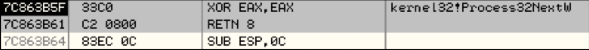  


## 2.8.  DebugObject: NtQueryObject()  
Instead of identifying if the process is being debugged, other techniques involve checking if a debugger is running in the system.  

One interesting method discussed in reversing forums is by checking the number of kernel objects of type DebugObject<sup>10</sup> . This works because every time an application is being debugged, in the kernel, an object of type DebugObject is created for the debugging session.  

The number of DebugObject can be obtained by querying information about all object types using ntdll!NtQueryObject(). NtQueryObject accepts 5 parameters, and for the purpose of querying all objects types, the ObjectHandle parameter is set to NULL and ObjectInformationClass is to ObjectAllTypeInformation (3):  

```cpp
NTSTATUS NTAPI NtQueryObject (
    HANDLE ObjectHandle,
    OBJECT_INFORMATION_CLASS ObjectInformationClass,
    PVOID ObjectInformation,
    ULONG Length,
    PULONG ResultLength
)
```

The said API returns an OBJECT_ALL_INFORMATION structure, in which the NumberOfObjectsTypes field is the count of total object types in the ObjectTypeInformation array:  
```cpp
typedef struct _OBJECT_ALL_INFORMATION {
    ULONG NumberOfObjectsTypes;
    OBJECT_TYPE_INFORMATION ObjectTypeInformation[1];
}
```

The detection routine will then iterate thru the ObjectTypeInformation array which has the following structure:  
```cpp
typedef struct _OBJECT_TYPE_INFORMATION {
    [00] UNICODE_STRING TypeName;
    [08] ULONG TotalNumberOfHandles;
    [0C] ULONG TotalNumberOfObjects;
    ... more fields ...
}
```
The TypeName field is then compared to the UNICODE string “DebugObject”, and then the TotalNumberOfObjects or the TotalNumberOfHandles field is checked for a non-zero value.  

***Solution***  
Similar to the NtQueryInformationProcess() solution, a breakpoint can be set where NtQueryObject() returns. Then, the returned OBJECT_ALL_INFORMATION structure can be patched. Specifically, the NumberOfbjectsTypes field can be set to 0 to prevent packers from iterating thru the ObjectTypeInformation array. A similar ollyscript from the NtQueryInformationProcess() solution can be created to perform this via a script.  

Similarly, the Olly advanced plugin injects code in the NtQueryObject() API which will zero out the entire returned buffer if the query is of type ObjectAllTypeInformation.  

<sup>10</sup> - More information about DebugObject can be found on the Windows Native Debugging Internals articles by Alex Ionescu on http://www.openrce.org/articles/full_view/25 and http://www.openrce.org/articles/full_view/26  


## 2.9.  Debugger Window
The existence of debugger windows are identifying marks that a debugger is running in the system. Since debuggers create windows with specific class names (OLLYDBG for OllyDbg, WinDbgFrameClass for WinDbg), these debugger windows are easily identified using user32!FindWindow() or user32!FindWindowEx().  

***Example***
The example code below uses FindWindow() to identify if OllyDbg or WinDbg is running in the system via the windows they create:  
```nasm
    push    NULL
    push    .szWindowClassOllyDbg
    call    [FindWindowA]
    test    eax,eax
    jnz     .debugger_found

    push    NULL
    push    .szWindowClassWinDbg
    call    [FindWindowA]
    test    eax,eax
    jnz     .debugger_found

.szWindowClassOllyDbg   db "OLLYDBG",0
.szWindowClassWinDbg    db "WinDbgFrameClass",0
```

***Solution***  
One solution is to set a breakpoint in the entry of FindWindow()/FindWindowEx(). When the breakpoint is hit, change the contents of the lpClassName string parameter so that the API will fail. Other solution involves just setting the return value to NULL.  


## 2.10.  Debugger Process  
Another way to identify if a debugger is running in the system is to list all process and check if the process name is that of a debugger (e.g. OLLYDBG.EXE, windbg.exe, etc.) The implementation is straight forward and just involves using Process32First/Next() and then checking if the image name is that of a debugger.  

Some packers also go as far as reading a process’ memory using kernel32!ReadProcessMemory() and then search for debugger-related strings (e.g. “OLLYDBG”) in case the reverser renames the debugger’s executable. Once a debugger is found, the packer may display an error message, silently exit or terminate the debugger.  

***Solution***  
Similar to the solution for the parent process check, the solution involves patching kernel32!Process32NextW() to always fail to prevent the packer from enumerating the processes.  


## 2.11.  Device Drivers  
A classic technique for detecting if a kernel mode debugger is active in the system is to try accessing their device drivers. The technique is fairly simple and just involves calling kernel32!CreateFile() against well-known device names used by kernel mode debuggers such as SoftICE.  

***Example***  
A simple check would be:  
```nasm
push    NULL
push    0
push    OPEN_EXISTING
push    NULL
push    FILE_SHARE_READ
push    GENERIC_READ
push    .szDeviceNameNtice
call    [CreateFileA]
cmp     eax,INVALID_HANDLE_VALUE
jne     .debugger_found
.szDeviceNameNtice  db "\\.\NTICE",0
```

Some versions of SoftICE also append numbers in the device name causing this check to always fail. A workaround described in reversing forums involve brute forcing the appended numbers until the correct device name is found. Newer packers also use the device driver detection technique to detect system monitors such as Regmon and Filemon.  

***Solution***  
A simple solution would be to set a breakpoint inside kernel32!CreateFileFileW(), and when the breakpoint is hit, either manipulate the FileName parameter or change its return value to INVALID_HANDLE_VALUE (0xFFFFFFFF).  


## 2.12.  OllyDbg: Guard Pages  
This check is specific to OllyDbg, since it is related to OllyDbg’s on-acess/write memory breakpoint feature.  

Aside from hardware and software breakpoints, OllyDbg allows an on-access/write memory breakpoint; this type of breakpoint is implemented using guard pages<sup>11</sup>. Simply stated, guard pages provide an application a way to be notified if a memory is being accessed.  

Guard pages are set using the PAGE_GUARD page protection modifier, if the address is being accessed is part of a guard page, STATUS_GUARD_PAGE_VIOLATION (0x80000001) will be raised. Packers use the behavior that if the process is being debugged under OllyDbg and a guard page is being accessed, no exception will be thrown, instead, the access will be treated as a memory breakpoint.  

***Example***  
In the example code below, the code allocates a memory, store code in the allocated memory, and then enable the PAGE_GUARD attribute. It then initializes its marker (EAX) to 0, and trigger the STATUS_GUARD_PAGE_VIOLATION by executing code in the page guarded allocated memory. If the code is being debugged in OllyDbg, the marker will be unchanged since the exception handler will not be called.  

```nasm
    ; set up exception handler
    push    .exception_handler
    push    dword [fs:0]
    mov     [fs:0], esp

    ; allocate memory
    push    PAGE_READWRITE
    push    MEM_COMMIT
    push    0x1000
    push    NULL
    call    [VirtualAlloc]
    test    eax,eax
    jz      .failed
    mov     [.pAllocatedMem],eax

    ; store a RETN on the allocated memory
    mov     byte [eax],0xC3

    ; then set the PAGE_GUARD attribute of the allocated memory
    lea     eax,[.dwOldProtect]
    push    eax
    push    PAGE_EXECUTE_READ | PAGE_GUARD
    push    0x1000
    push    dword [.pAllocatedMem]
    call    [VirtualProtect]

    ; set marker (EAX) as 0
    xor     eax,eax
    ; trigger a STATUS_GUARD_PAGE_VIOLATION exception
    call    [.pAllocatedMem]
    ; check if marker had not been changed (exception handler not called)
    test    eax,eax
    je      .debugger_found
    :::

.exception_handler
    ;EAX = CONTEXT record
    mov     eax,[esp+0xc]
    ;set marker (CONTEXT.EAX) to 0xffffffff
    ; to signal that the exception handler was called
    mov     dword [eax+0xb0],0xffffffff
    xor     eax,eax
    retn
```

***Solution***  
Since guard pages triggers an exception, the reverser can deliberately trigger an exception so that the exception handler will be called. In the example shown, a reverser can replace the RETN instruction with an “INT3” then a “RETN” instruction, once INT3 is executed, force the debugger to call the exception handler via Shift+F9. Then, after the exception handler is called, EAX will be set to the proper value, and then the RETN instruction will be executed.  

If the exception handler checks if the exception was indeed a STATUS_GUARD_PAGE_VIOLATION, a reverser can set a breakpoint in the exception handler and then modify the passed ExceptionRecord parameter, specifically, ExceptionRecord. ExceptionCode is set to STATUS_GUARD_PAGE_VIOLATION manually.

<sup>11</sup> - See http://msdn2.microsoft.com/en-us/library/aa366549.aspx for explanation of guard pages  


# 3.  Techniques: Breakpoint and Patching Detection  
This section lists the most common ways on how packers identify software breakpoints, hardware breakpoints and patching.  


# 3.1.  Software Breakpoint Detection
Software breakpoints are breakpoints which are set by modifying the code at the target address, replacing it with a byte value 0xCC (INT3 / Breakpoint Interrupt). Packers identify software breakpoints by scanning for the byte 0xCC in the protector code and/or an API code.  

***Example***  
A check can be as simple as the following:  
```nasm
    cld
    mov     edi,Protected_Code_Start
    mov     ecx,Protected_Code_End - Protected_Code_Start
    mov     al,0xcc
    repne   scasb
    jz      .breakpoint_found
```

Some packers apply some operation on the compared byte value so the check is not obvious, such as:  
```cpp
if(byte XOR 0x55 == 0x99) then breakpoint found
Where: 0x99 == 0xCC XOR 0x55
```

***Solution***  
If software breakpoints are being identified, the reverser can use hardware breakpoints instead. If a breakpoint is needed to be set inside an API code, but the packer attempts to search for breakpoints inside an API code, the reverser can set a breakpoint on the UNICODE version of the API which will be eventually called by the ANSI versions (eg: LoadLibraryExW instead of LoadLibraryA), or the corresponding native API (ntdll!LdrLoadDll) instead.  


# 3.2. Hardware Breakpoint Detection  
Another type of breakpoint is a hardware breakpoint. Hardware breakpoints are set by setting the debug registers<sup>12</sup>, these registers are named Dr0 to Dr7. Dr0-Dr3 contains the address of up to four breakpoints, Dr6 contains flags to identify what breakpoint had been triggered, while Dr7 contains flags to control the four hardware breakpoints such as enabling/disabling breakpoints or breaking on read/write. 

Detecting hardware breakpoints requires a bit of code to perform since debug registers are not accessible in Ring 3. Thus, packers utilize the CONTEXT structure which contains the values of the debug registers. The CONTEXT structure is accessed via the ContextRecord parameter passed to an exception handler.  

***Example***  
Here is an example code to query the debug registers:  
```nasm
    ; set up exception handler
    push    .exception_handler
    push    dword [fs:0]
    mov     [fs:0], esp

    ; eax will be 0xffffffff if hardware breakpoints are identified
    xor     eax,eax

    ; throw an exception
    mov     dword [eax],0

    ; restore exception handler
    pop     dword [fs:0]
    add     esp,4

    ; test if EAX was updated (breakpoint identified)
    test    eax,eax
    jnz     .breakpoint_found

    :::

.exception_handler
    ;EAX = CONTEXT record
    mov     eax,[esp+0xc]

    ;check if Debug Registers Context.Dr0-Dr3 is not zero
    cmp     dword [eax+0x04],0
    jne     .hardware_bp_found
    cmp     dword [eax+0x08],0
    jne     .hardware_bp_found
    cmp     dword [eax+0x0c],0
    jne     .hardware_bp_found
    cmp     dword [eax+0x10],0
    jne     .hardware_bp_found
    jmp     .exception_ret

.hardware_bp_found
    ;set Context.EAX to signal breakpoint found
    mov     dword [eax+0xb0],0xffffffff

.exception_ret
    ;set Context.EIP upon return
    add     dword [eax+0xb8],6
    xor     eax,eax
    retn
```

Some packers also use the debug registers as part of decryption keys. Either these registers are initialized to a specific value or left to have the value 0. Thus, if these debug registers are modified, decryption will fail and will cause unexpected termination due to invalid instructions if the code being decrypted is part of the unpacking stub or the protected executable.  

***Solution***  
The reverser can try using software breakpoints if software breakpoints are not being checked. Also, the on-access/write memory breakpoint feature of OllyDbg can be used. Setting software breakpoints inside UNICODE version of the APIs or the native APIs can be another solution if the reverser would need to set API breakpoints.  

<sup>12</sup> - See “Debug Registers” in IA-32 Intel® Architecture Software Developer's Manual Volume 3B: System Programming Guide, Part 2  


## 3.3.  Patching Detection via Code Checksum Calculation  
Patching detection tries to identify if a part of the packer code had been modified which suggests that anti-debugging routines may had been disabled, and as a second purpose can identify if software breakpoints are set. Patching detection is implemented via code checksum, and the checksum calculation can range from simple to intricate checksum/hash algorithms.  

***Example***  
Below is a fairly simple example for checksum calculation:  
```nasm
    mov     esi,Protected_Code_Start
    mov     ecx,Protected_Code_End - Protected_Code_Start
    xor     eax,eax
.checksum_loop
    movzx   ebx,byte [esi]
    add     eax,ebx
    rol     eax,1
    inc     esi
    loop    .checksum_loop

    cmp     eax,dword [.dwCorrectChecksum]
    jne     .patch_found
```

***Solution***  
If software breakpoints are being identified by a code checksum routine, hardware breakpoints can be used instead. If code patching is being identified by the checksum routine, a reverser can identify where the checksum routine is by setting an on-access breakpoint on the patched address, and once the checksum routine is found, modify the checksum value to the expected value or just change the appropriate flags after a failed comparison.  


# 4.  Techniques: Anti-Analysis  
Anti-analysis techniques aim to slow down reversers from analyzing and understanding the protector code and/or the packed executable. Techniques such as encryption/compression, garbage code, permutation, and anti-disassembly are discussed. These are the techniques which require a reverser to have traits such as patience and cleverness in order to solve since they aim to confuse, bore and waste the time of a reverser.  


## 4.1.  Encryption and Compression  
Encryption and compression are the most basic forms of anti-analysis. They are initial defenses to prevent a reverser from just loading the protected executable in a disassembler and then start analysis without any difficulty.  

**Encryption**. Packers usually encrypt both the protector code and the protected executable. The encryption algorithm greatly varies between packers, which range from very simple XOR loops to very complex loops that perform several computations. With polymorphic packers, the encryption algorithm also varies between generated samples and the decryption code is permutated to look very different on each generated samples, and may prevent a packer identifier tool from correctly identifying the packer.  

Decryption routines are easily recognizable as loops which perform a fetch, compute, and store data operation. Below is an example of a simple decryption routine that performs several XOR operations on an encrypted DWORD value.  
```nasm
0040A07C    LODS DWORD PTR DS:[ESI]
0040A07D    XOR EAX,EBX
0040A07F    SUB EAX,12338CC3
0040A084    ROL EAX,10
0040A087    XOR EAX,799F82D0
0040A08C    STOS DWORD PTR ES:[EDI]
0040A08D    INC EBX
0040A08E    LOOPD SHORT 0040A07C        ;decryption loop
```

Here is another example of a decryption routine of a polymorphic packer:  
<pre>
<b>00476056    MOV BH,BYTE PTR DS:[EAX]</b>
00476058    INC ESI
<b>00476059    ADD BH,0BD</b>
<b>0047605C    XOR BH,CL</b>
0047605E    INC ESI
0047605F    DEC EDX
<b>00476060    MOV BYTE PTR DS:[EAX],BH</b>
00476062    CLC
00476063    SHL EDI,CL

::: More    garbage code

00476079    INC EDX
0047607A    DEC EDX
<b>0047607B    DEC EAX</b>
0047607C    JMP SHORT 0047607E
<b>0047607E    DEC ECX</b>
<b>0047607F    JNZ 00476056 ;decryption loop</b>
</pre>

And below is another decryption routine generated by the same polymorphic packer:  
<pre>
<b>0040C045    MOV CH,BYTE PTR DS:[EDI]</b>
0040C047    ADD EDX,EBX
<b>0040C049    XOR CH,AL</b>
<b>0040C04B    XOR CH,0D9</b>
0040C04E    CLC
<b>0040C04F    MOV BYTE PTR DS:[EDI],CH</b>
0040C051    XCHG AH,AH
0040C053    BTR EDX,EDX
0040C056    MOVSX EBX,CL

::: More garbage code

0040C067    SAR EDX,CL
0040C06C    NOP
<b>0040C06D    DEC EDI</b>
<b>0040C06E    DEC EAX</b>
0040C06F    JMP SHORT 0040C071
<b>0040C071    JNZ 0040C045 ;decryption loop</b>
</pre>

In the last two examples, the highlighted lines are the main decryption instructions, while the remaining instructions are garbage codes to confuse the reverser. Notice how the registers are being swapped and how the decryption method changes between the two examples.  

**Compression**. The main purpose of compression is to reduce the size of the executable code and its data, but because this results for the original executable including its readable strings becoming compressed data, it has the side effect of obfuscation. Some examples of compression engine used by packers are - NRV (Not Really Vanished) compression and LZMA (Lempel-Ziv-Markov chain-Algorithm) for UPX, aPLib for FSG, LZMA for Upack and LZO for yoda’s Protector. Some of these compression engines are free for non-commercial use but requires a license/registration for commercial use.  

***Solution***  
Decryption and decompression loops are easy to bypass, the reverser just needs to know when the decryption/decompression loop terminates and then set a breakpoint on the instruction after the loop. Remember, some packers may have breakpoint detection code inside these decryption loops.  


## 4.2. Garbage Code and Code Permutation  
Garbage Code. Inserting garbage code in the unpacking routine is another effective way to confuse a reverser. It aims to hide the real purpose of the code, be it a decryption routine or anti-reversing routines such as debugger detection. Garbage code adds effectiveness to the debugger/breakpoint/patching detection techniques described in this paper by hiding them in a mass of unrelated “do nothing” and confusing instructions. Furthermore, effective garbage codes are those that look like legitimate/working code.  

***Example***  
Below is an example decryption routine with several garbage code inserted between the relevant instructions:
```nasm
0044A21A    JMP SHORT sample.0044A21F
0044A21C    XOR DWORD PTR SS:[EBP],6E4858D
0044A223    INT 23
0044A225    MOV ESI,DWORD PTR SS:[ESP]              ; Relevant
0044A228    MOV EBX,2C322FF0
0044A22D    LEA EAX,DWORD PTR SS:[EBP+6EE5B321]
0044A233    LEA ECX,DWORD PTR DS:[ESI+543D583E]
0044A239    ADD EBP,742C0F15
0044A23F    ADD DWORD PTR DS:[ESI],3CB3AA25         ; Relevant
0044A245    XOR EDI,7DAC77F3
0044A24B    CMP EAX,ECX
0044A24D    MOV EAX,5ACAC514
0044A252    JMP SHORT sample.0044A257
0044A254    XOR DWORD PTR SS:[EBP],AAE47425
0044A25B    PUSH ES
0044A25C    ADD EBP,5BAC5C22
0044A262    ADC ECX,3D71198C
0044A268    SUB ESI,-4                              ; Relevant
0044A26B    ADC ECX,3795A210
0044A271    DEC EDI
0044A272    MOV EAX,2F57113F
0044A277    PUSH ECX
0044A278    POP ECX
0044A279    LEA EAX,DWORD PTR SS:[EBP+3402713D]
0044A27F    DEC EDI
0044A280    XOR DWORD PTR DS:[ESI],33B568E3         ; Relevant
0044A286    LEA EBX,DWORD PTR DS:[EDI+57DEFEE2]
0044A28C    DEC EDI
0044A28D    SUB EBX,7ECDAE21
0044A293    MOV EDI,185C5C6C
0044A298    MOV EAX,4713E635
0044A29D    MOV EAX,4                               ; Relevant
0044A2A2    ADD ESI,EAX                             ; Relevant
0044A2A4    MOV ECX,1010272F
0044A2A9    MOV ECX,7A49B614
0044A2AE    CMP EAX,ECX
0044A2B0    NOT DWORD PTR DS:[ESI]                  ; Relevant
```

The only relevant decryption instructions in the example were:  
```nasm
0044A225    MOV ESI,DWORD PTR SS:[ESP]
0044A23F    ADD DWORD PTR DS:[ESI],3CB3AA25
0044A268    SUB ESI,-4
0044A280    XOR DWORD PTR DS:[ESI],33B568E3
0044A29D    MOV EAX,4
0044A2A2    ADD ESI,EAX
0044A2B0    NOT DWORD PTR DS:[ESI]
```

**Code Permutation**. Code permutation is another technique used by more advanced packers. With code permutation, simple instructions are translated into a more complex series of instructions. This requires the packer to understand the instructions and generate new series of instructions that performs the equivalent operation.  

A simple permutation example would be the following instructions:  
```nasm
    mov     eax,ebx
    test    eax,eax
```

Being translated into the following equivalent instructions:  
```nasm
    push    ebx
    pop     eax
    or      eax,eax
```

Combined with garbage code, permutated code is an effective technique to slow down a reverser from understanding a protected code.  

***Example***  
To illustrate, below is an example of a debugger detection routine which had been permutated and garbage codes inserted in between the permutated instructions:  
```nasm
004018A3    MOV EBX,A104B3FA
004018A8    MOV ECX,A104B412
004018AD    PUSH 004018C1
004018B2    RETN
004018B3    SHR EDX,5
004018B6    ADD ESI,EDX
004018B8    JMP SHORT 004018BA
004018BA    XOR EDX,EDX
004018BC    MOV EAX,DWORD PTR DS:[ESI]
004018BE    STC
004018BF    JB SHORT 004018DE
004018C1    SUB ECX,EBX
004018C3    MOV EDX,9A01AB1F
004018C8    MOV ESI,DWORD PTR FS:[ECX]
004018CB    LEA ECX,DWORD PTR DS:[EDX+FFFF7FF7]
004018D1    MOV EDX,600
004018D6    TEST ECX,2B73
004018DC    JMP SHORT 004018B3
004018DE    MOV ESI,EAX
004018E0    MOV EAX,A35ABDE4
004018E5    MOV ECX,FAD1203A
004018EA    MOV EBX,51AD5EF2
004018EF    DIV EBX
004018F1    ADD BX,44A5
004018F6    ADD ESI,EAX
004018F8    MOVZX EDI,BYTE PTR DS:[ESI]
004018FB    OR EDI,EDI
004018FD    JNZ SHORT 00401906
```

The example shown is just a simple debugger detection routine:  
```nasm
00401081    MOV EAX,DWORD PTR FS:[18]
00401087    MOV EAX,DWORD PTR DS:[EAX+30]
0040108A    MOVZX EAX,BYTE PTR DS:[EAX+2]
0040108E    TEST EAX,EAX
00401090    JNZ SHORT 00401099
```

***Solution***  
Garbage codes and permutated instructions are ways to bore and waste the reverser’s time. Thus, it is important to know if the hidden instructions between these obscuring techniques are worth understanding (eg: just performing decryption, packer initialization etc).  

One way to avoid tracing thru the obscured instructions is to try setting breakpoints on APIs which packers mostly used (eg: VirtualAlloc/VirtualProtect/LoadLibrary/GetProcAddress, etc.) or an API logging tool can also be used, and then treat these APIs as “**trace markers**” in a packer trace. If something went wrong (such as the debugger or breakpoints being detected) in between these trace markers, then it is the time to do a detailed trace of the code. Additionally, setting on-access/write breakpoints allows a reverser to pinpoint what instructions are trying to modify/access interesting parts of the protected process instead of tracing thru a mass of code that eventually (and hopefully) lead to the exact routine.  

Finally, running OllyDbg in VMWare and routinely taking snapshots of the debugging session allows the reverser to go back on a specific trace state. And if something went wrong, the tracing session can be reverted back to a specific trace state.


## 4.3.  Anti-Disassembly  
Another way to confuse the reverser is to obfuscate the disassembly. Anti-disassembly is an effective way to complicate the process of understanding the binary via static analysis, and if combined with garbage code and permutation, makes it even more effective.  

One example of an anti-disassembly technique is to insert a garbage byte and then add a conditional branch which will transfer execution to the garbage byte; however, the condition for the conditional branch will always be FALSE. Thus, the garbage byte will never be executed but will trick disassemblers to start disassembling the garbage byte address, which eventually will lead to an incorrect disassembly output.  

***Example***  
Here is an example of the simple PEB.BeingDebugged flag check with some anti-disassembly code added. The highlighted lines are the main instructions, while the remaining are the anti- disassembly codes. It uses the garbage byte 0xff and adds fake conditional jump into the  garbage byte for disassemblers to follow:  
```nasm
    ;Anti-disassembly sequence #1
    push .jmp_real_01
    stc
    jnc .jmp_fake_01
    retn
.jmp_fake_01:
    db 0xff

.jmp_real_01:
    ;--------------------------
    mov eax,dword [fs:0x18]

    ;Anti-disassembly sequence #2
    push .jmp_real_02
    clc
    jc .jmp_fake_02
    retn

.jmp_fake_02:
    db 0xff

.jmp_real_02:
    ;--------------------------
    mov eax,dword [eax+0x30]
    movzx eax,byte [eax+0x02]
    test eax,eax
    jnz .debugger_found
```

Below is the disassembly output in WinDbg:  
```nasm
0040194a    6854194000      push    0x401954
0040194f    f9              stc
00401950    7301            jnb     image00400000+0x1953 (00401953)
00401952    c3              ret
00401953    ff64a118        jmp     dword ptr [ecx+0x18]
00401957    0000            add     [eax],al
00401959    006864          add     [eax+0x64],ch
0040195c    194000          sbb     [eax],eax
0040195f    f8              clc
00401960    7201            jb      image00400000+0x1963 (00401963)
00401962    c3              ret
00401963    ff8b40300fb6    dec     dword ptr [ebx+0xb60f3040]
00401969    40              inc     eax
0040196a    0285c0750731    add     al,[ebp+0x310775c0]
```

And the disassembly output in OllyDbg:  
```nasm
0040194A    68 54194000     PUSH    00401954
0040194F    F9              STC
00401950    73 01           JNB     SHORT 00401953
00401952    C3              RETN
00401953    FF64A1 18       JMP     DWORD PTR DS:[ECX+18]
00401957    0000            ADD     BYTE PTR DS:[EAX],AL
00401959    0068 64         ADD     BYTE PTR DS:[EAX+64],CH
0040195C    1940 00         SBB     DWORD PTR DS:[EAX],EAX
0040195F    F8              CLC
00401960    72 01           JB      SHORT 00401963
00401962    C3              RETN
00401963    FF8B 40300FB6   DEC     DWORD PTR DS:[EBX+B60F3040]
00401969    40              INC     EAX
0040196A    0285 C0750731   ADD     AL,BYTE PTR SS:[EBP+310775C0]
```

And finally, the disassembly output in IDAPro:  
```nasm
0040194A        push (offset loc_401953+1)
0040194F        stc
00401950        jnb short loc_401953
00401952        retn
00401953  ; --------------------------------------------------------------
00401953        
00401953  loc_401953: ; CODE XREF: sub_401946+A
00401953        ; DATA XREF: sub_401946+4
00401953        jmp dword ptr [ecx+18h]
00401953  sub_401946 endp
00401953        
00401953  ; --------------------------------------------------------------
00401957        db 0
00401958        db 0
00401959        db 0
0040195A        db 68h      ; h
0040195B        dd offset unk_401964
0040195F        db 0F8h     ; °
00401960        db 72h      ; r
00401961        db 1
00401962        db 0C3h     ; +
00401963        db 0FFh
00401964  unk_401964 db 8Bh ; ï ; DATA XREF: text:0040195B
00401965        db 40h      ; @
00401966        db 30h      ; 0
00401967        db 0Fh
00401968        db 0B6h     ; 
00401969        db 40h      ; @
0040196A        db 2
0040196B        db 85h      ; à
0040196C        db 0C0h     ; +
0040196D        db 75h      ; u
```

Notice how all three disassemblers/debuggers had fallen into the anti-disassembly trick, which is very annoying and confusing to a reverser analyzing the disassembly. There are several other ways to confuse disassemblers, and the illustration was just one example. Additionally, these anti-disassembly codes can be coded in a macro so that the assembly source is cleaner.  

The reader is advised to refer to an excellent reversing book by Eldad Eliam<sup>13</sup> which contains detailed information about anti-disassembly techniques and other reversing topics.  

<sup>13</sup> - See Reversing: Secrets of Reverse Engineering in the reference section  


# 5.  Techniques: Debugger Attacks  
This section enumerates techniques that packers use to actively attack the debugger in such a way that execution will suddenly stop if the process is being debugged, breakpoints are disabled, etc. Similar to the previously described techniques, these techniques can be made more effective if they are hidden using anti-analysis techniques.  


## 5.1.  Misdirection and Stopping Execution via Exceptions  
Tracing thru the code in a linear manner allows a reverser to easily understand and grasp the purpose of the code. Thus, some packers employ several techniques so that tracing the code is not linear and time consuming.  

One commonly used technique is to throw several exceptions in the process of unpacking. By throwing caught exceptions, the reverser will need to understand where EIP will be pointing to upon exception, and where the EIP will be pointing after the exception handler had executed.  

Additionally, exceptions are a way for packers to repeatedly stop execution of the unpacking code. Because when exceptions are thrown and the process is under a debugger, the debugger temporarily stops execution of the unpacking code.  

Packers commonly use the Structured Exception Handling (SEH)<sup>14</sup> as a mechanism for exception handling. However, newer packers also started to use Vectored Exceptions<sup>15</sup>.  

***Example***  
Below is an example code that performs misdirection by throwing an overflow exception (via INTO) when the overflow flag is set by the ROL instruction after loop iteration. But since an overflow exception is a trap exception, EIP will just point to the JMP instruction. If the reverser is using OllyDbg, and the reverser did not pass the exception to the exception handler (via Shift+F7/F8/F9) and just continually performs a step, the reverser will be tracing an endless loop.  
```nasm
    ; set up exception handler
    push    .exception_handler
    push    dword [fs:0]
    mov     [fs:0], esp

    ; throw an exception
    mov     ecx,1

.loop:
    rol     ecx,1
    into
    jmp     .loop

    ; restore exception handler
    pop     dword [fs:0]
    add     esp,4
    :::

.exception_handler
    ;EAX = CONTEXT record
    mov     eax,[esp+0xc]
    ;set Context.EIP upon return
    add     dword [eax+0xb8],2
    xor     eax,eax
    retn
```

Packers commonly throw access violations (0xC0000005), breakpoint (0x80000003) and single step (0x80000004) exceptions.  

***Solution***  
For packers which uses caught exceptions for no other reason than transferring execution to different parts of the code, OllyDbg can be configured so that exceptions are automatically passed to exceptions handlers. This feature can be configured via Options -> Debugging Options -> Exceptions. On the right side is a screen shot of the configuration dialog for handling exceptions. A reverser can also add custom exceptions if the exception is not one of those that can be selected via a checkbox.  

For packers which performs important operations inside an exception handler. The reverser can set a breakpoint in the exception handler in which the address can be viewed in OllyDbg using View->SEH Chain. Then, pressing Shift+F7/F8/F9 to transfer control to the exception handler.  
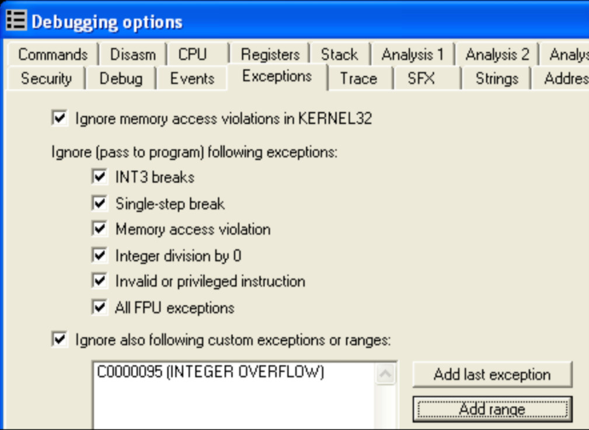  


<sup>14</sup> - See http://microsoft.com/msj/0197/exception/exception.aspx for in-depth information about SEH  
<sup>15</sup> - See http://msdn.microsoft.com/msdnmag/issues/01/09/hood/ for an in-depth information about Vectored Exceptions  


## 5.2.  Blocking Input  
To prevent a reverser from controlling the debugger, a packer can use the user32!BlockInput() API to block keyboard and mouse input while the main unpacking routine is being executed. Hidden within garbage codes and anti-disassembly techniques, this can be effective if not identified by the reverser. If executed, the system will appear to be unresponsive, leaving the reverser baffled.  

A typical example would be a reverser setting a breakpoint inside GetProcAddress(), then running the unpacking code until the breakpoint is hit. However, in the process of skipping several garbage codes, the packer had called BlockInput(). And once the GetProcAddress() breakpoint is hit, the reverser suddenly cannot control the debugger leaving him perplexed on what just happened.

***Example***  
BlockInput() takes 1 boolean parameter fBlockIt. If true, keyboard and mouse events are blocked, if false, keyboard and mouse events are unblocked:  
```nasm
    ; Block input
    push    TRUE
    call    [BlockInput]

    ; ...Unpacking code...

    ; Unblock input
    push    FALSE
    call    [BlockInput]
```

***Solution***  
Fortunately, the simple solution to patch BlockInput() to just perform a RETN. Here’s the ollyscript to patch the entry of user32!BlockInput():  
```nasm
gpa     "BlockInput", "user32.dll"
mov     [$RESULT], #C20400# //retn 4
```

The Olly Advanced plugin also has the option to patch BlockInput(). Additionally, pressing CTRL+ALT+DELETE will allow the user to unblock input manually.  


## 5.3.  ThreadHideFromDebugger  
This technique uses the API ntdll!NtSetInformationThread() which is usually used for setting a thread’s priority. However, the said API can also be used to prevent debugging events to be sent to the debugger.  

The parameters to NtSetInformationThread() are shown below. To perform this technique, TheadHideFromDebugger (0x11) is passed as the ThreadInformationClass parameter, ThreadHandle is usually set to the current thread handle (0xfffffffe):  

```cpp
NTSTATUS NTAPI NtSetInformationThread (
    HANDLE ThreadHandle,
    THREAD_INFORMATION_CLASS ThreadInformationClass,
    PVOID ThreadInformation,
    ULONG ThreadInformationLength
);
```
Internally, ThreadHideFromDebugger will set the HideThreadFromDebugger field of the ETHREAD<sup>16</sup> kernel structure. Once set, the internal kernel function DbgkpSendApiMessage(), whose main purpose is to send events to the debugger is never invoked.

***Example***  
A typical example of a call to the NtSetInformationThread() would be:  
```nasm
push    0                           ; InformationLength
push    NULL                        ; ThreadInformation
push    ThreadHideFromDebugger      ; 0x11
push    0xfffffffe                  ; GetCurrentThread()
call    [NtSetInformationThread]
```

***Solution***  
A breakpoint can be set in ntdll!NtSetInformationThread(), and once hit, the reverser can manipulate the EIP to the prevent the API call from reaching the kernel. This can also be done automatically via an ollyscript. Additionally, the Olly Advanced plugin has the option to patch this API so that if the ThreadInformationClass parameter is set to HideThreadFromDebugger, it will just perform a return instead of calling the kernel code.  

<sup>16</sup> - Data type of the ETHREAD structure is _ETHREAD  


## 5.4.  Disabling Breakpoints  
Another way to attack the debugger is by disabling breakpoints. To disable hardware breakpoints, a packer will modify the debug registers via the CONTEXT structure.  

***Example***  
In this example, the debug registers are cleared via the CONTEXT record passed to the exception handler:  
```nasm
    ; set up exception handler
    push    .exception_handler
    push    dword [fs:0]
    mov     [fs:0], esp

    ; throw an exception
    xor     eax,eax
    mov     dword [eax],0

    ; restore exception handler
    pop     dword [fs:0]
    add     esp,4
    :::

.exception_handler
    ;EAX = CONTEXT record
    mov     eax,[esp+0xc]

    ;Clear Debug Registers: Context.Dr0-Dr3,Dr6,Dr7
    mov     dword [eax+0x04],0
    mov     dword [eax+0x08],0
    mov     dword [eax+0x0c],0
    mov     dword [eax+0x10],0
    mov     dword [eax+0x14],0
    mov     dword [eax+0x18],0

    ;set Context.EIP upon return
    add     dword [eax+0xb8],6
    xor     eax,eax
    retn
```

On the other hand, with software breakpoints, the packer can just search for INT3s (0xCC) and replace them with an arbitrary/random opcode; by doing this, the breakpoint will be disabled and the original instruction is corrupted.  

***Solution***  
Clearly, if hardware breakpoints are being detected, software breakpoints can be used, vice versa. If both are being detected, try using the on-memory access/write breakpoints feature of OllyDbg.  


## 5.5.  Unhandled Exception Filter  
The MSDN documentation states that if an exception reaches unhandled exception filter (kernel32!UnhandledExceptionFilter), and that the application is not being debugged, the unhandled exception filter will call the top level exception filter specified as parameter in the kernel32!SetUnhandledExceptionFilter() API. Packers take advantage of this by setting up an exception filter and then throwing an exception, the exception will just be received by the debugger as a second chance exception if it is being debugged, otherwise, control is transferred into the exception filter and execution can continue.  

***Example***  
Below is an example in which an top level exception filter is set using SetUnhandledExceptionFilter(), and then an access violation is thrown. If the process is being debugged, the debugger will just receive a second chance exception; otherwise, the exception filter will setup CONTEXT.EIP and continue the execution.  
```nasm
    ;set the exception filter
    push .exception_filter
    call [SetUnhandledExceptionFilter]
    mov [.original_filter],eax

    ;throw an exception
    xor eax,eax
    mov dword [eax],0

    ;restore exception filter
    push dword [.original_filter]
    call [SetUnhandledExceptionFilter]

    :::

.exception_filter:
    ;EAX = ExceptionInfo.ContextRecord
    mov eax,[esp+4]
    mov eax,[eax+4]

    ;set return EIP upon return
    add dword [eax+0xb8],6

    ;return EXCEPTION_CONTINUE_EXECUTION
    mov eax,0xffffffff
    retn
```

Some packers also manually set up the exception filter by setting kernel32! _BasepCurrentTopLevelFilter directly instead of calling SetUnhandledExceptionFilter(), this is in case the reverser sets a breakpoint on the said API.  

***Solution***  
Interestingly, the code inside kernel32!UnhandledExceptionFilter() uses ntdll!NtQueryInformationProcess (ProcessDebugPort) to determine if the process is being debugged, which it will then use to decide whether to call the registered exception filter or not. Thus, the solution is the same solution as the DebugPort debugger detection technique.  


## 5.6.  OllyDbg: OutputDebugString() Format String Bug  
This debugger attack is specific to OllyDbg. OllyDbg is known to be vulnerable to a format string bug which can cause it to crash or execute arbitrary code, the bug is triggered by an improper string parameter passed to kernel32!OutputDebugString(). This bug exists in the current version of OllyDbg (1.10) and still not patched.  

***Example***  
This simple example causes OllyDbg to throw an access violation or unexpectedly terminate:  
```nasm
    push    .szFormatString
    call    [OutputDebugStringA]
    :::
.szFormatString     db "%s%s",0
```

***Solution***  
The solution involves patching the entry of kernel32!OutputDebugStringA() so it will just perform a RETN.  


# 6.  Techniques: Advanced and Other Techniques  
This section enumerates advanced and other techniques that do not fall in the previous anti-reversing categories.  


## 6.1.  Process Injection  
Process injection has become a feature of some packers. With this feature, the unpacking stub spawns a selected host process (e.g.: itself, explorer.exe, iexplorer.exe, etc.) and then inject the unpacked executable into the host process.  
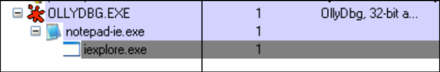  

On the right side is a screen shot of a packer that supports process injection. Malcodes use this packer feature to allow them to bypass some firewalls that checks if the process is in the list of allowed applications to perform external network connections.  
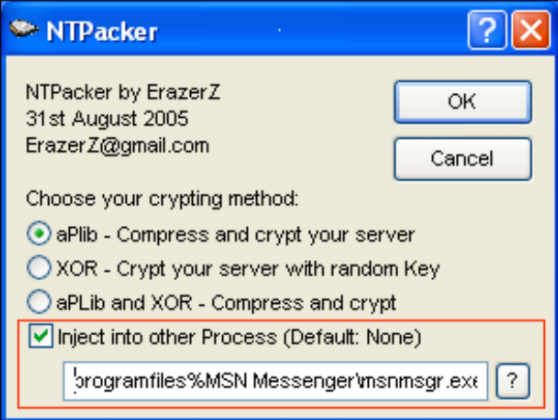  

One method that packers use to perform process injection is as follows:  
1.  Spawn the host process as a suspended child process. This is done using the CREATE_SUSPENDED process creation flag passed to kernel32!CreateProcess(). At this point an initialization thread is created and suspended, DLLs are still not loaded since the loader routine (ntdll!LrdInitializeThunk) is still not called. The context of the said thread is setup such as the register values contains information such as the PEB address, and entry point of the host process. 
2.  Using kernel32!GetThreadContext(), the context of the child process’ initialization thread is retrieved  
3.  The PEB address of the child process is retrieved via CONTEXT.EBX  
4.  The image base of the child process is retrieved by reading PEB.ImageBase (PEB + 0x8)  
5.  The original host image in the child process is then unmapped using ntdll!NtUnmapViewOfSection() with the BaseAddress parameter pointing to the retrieved image base  
6.  The unpacking stub will then allocate memory inside the child process using kernel32!VirtualAllocEx() with dwSize parameter equal to the image size of the unpacked executable.  
7.  Using kernel32!WriteProcessMemory(), the PE header and each of the sections of the unpacked executable is written to the child process.  
8.  The PEB.ImageBase of the child process is then updated to match the image base of the unpacked executable.  
9.  The context of the child process’ initialization thread is then updated via kernel32!SetThreadContext() in which CONTEXT.EAX is set to the entry point of the unpacked executable.  
10.  Execution of the child process is resumed via kernel32!ResumeThread()

In order to debug the spawned child process beginning from its entry point, the reverser can set a breakpoint in WriteProcessMemory() and when the section containing the entry point is about to be written to the child process, the entry point code is patched with a “jump to self” instruction (0xEB 0xFE). When the main thread of the child process is resumed, the child process will enter an endless loop in its entry point. Then, at that point, the reverser can attach a debugger in the child process, restore the modified instructions, and continue normal debugging.  


## 6.2.  Debugger Blocker  
A featured that had been introduced by the Armadillo packer is called the Debugger Blocker. This prevents a reverser from attaching a debugger to a protected process. This protection is implemented thru the use of debugging functions provided by Windows.  

Specifically, the unpacking stub acts a debugger (parent process) where it spawns and debugs/controls the child process which contains the unpacked executable.  
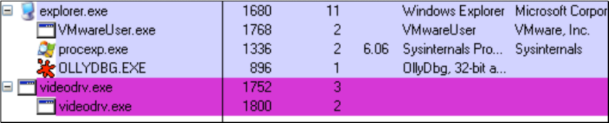  

Since the protected process is already being debugged, attaching a debugger via kernel32!DebugActiveProcess() will fail since the corresponding native API, ntdll!NtDebugActiveProcess() will return STATUS_PORT_ALREADY_SET. Internally, the failure of NtDebugActiveProcess() is due to the DebugPort field of the EPROCESS kernel structure being already set.  

In order to attach a debugger to the protected process, a solution posted on several reversing forums involves invoking kernel32!DebugActiveProcessStop() in the context of the parent process. This can be done by attaching a debugger on the parent process, and setting a breakpoint inside kernel32!WaitForDebugEvent(), once the breakpoint is hit, a code to invoke DebugActiveProcessStop(ChildProcessPID) is then injected and executed, once the call succeeds, a debugger can be attached to the protected process.  


## 6.3.  TLS Callbacks  
Another technique used by packers is to execute code before the actual entry point is executed. This is achieved thru the use Thread Local Storage (TLS) callback functions. Packers may perform its debugger detection and decryption routines via these callback functions so that the reverser will not be able to trace these routines.  

TLS callbacks can be identified using PE file parsing tools such as pedump. With pedump, the Data Directory entries will display if a TLS directory exists in the executable:  
<pre>
Data Directory
    EXPORT          rva: 00000000   size: 00000000
    IMPORT          rva: 00061000   size: 000000E0
    :::
    <b>TLS             rva: 000610E0   size: 00000018</b>
    :::
    IAT             rva: 00000000   size: 00000000
    DELAY_IMPORT    rva: 00000000   size: 00000000
    COM_DESCRPTR    rva: 00000000   size: 00000000
    unused          rva: 00000000   size: 00000000
</pre>

Then, the actual contents TLS directory is displayed. The AddressOfCallBacks field points to an array of callback functions and is null-terminated:  
<pre>
TLS directory:
    StartAddressOfRawData:  00000000
    EndAddressOfRawData:    00000000
    AddressOfIndex:         004610F8
    <b>AddressOfCallBacks:     004610FC</b>
    SizeOfZeroFill:         00000000
    Characteristics:        00000000
</pre>

In this example, RVA 0x4610fc points to the callback function pointers (0x490f43 and 0x44654e):  
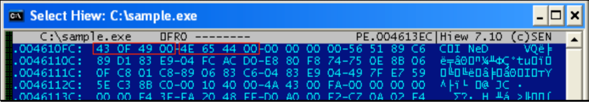  

By default, OllyDbg will load the sample then pause at the entry point. Since TLS callbacks are called before the actual entry point, OllyDbg should be configured so that that it will break on the actual loader and before the TLS callbacks are called.  

Breaking on the actual loader code inside ntdll.dll can be set by selecting Options -> Debugging Options -> Events -> Make first pause at -> System breakpoint.  
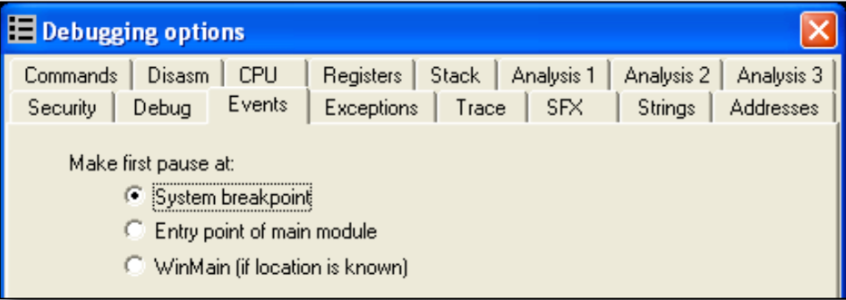  

Once set, OllyDbg will break  inside ntdll! _LdrpInitialize- Process() which is just before ntdll!_LdrpRunInitializeRoutines() executes the TLS callbacks. Once set, breakpoints can be set on the callback routines and then traced.  

More information about the PE file format including the binary/source for pedump can be found on the following links:
-  An In-Depth Look into the Win32 Portable Executable File Format by Matt Pietrek http://msdn.microsoft.com/msdnmag/issues/02/02/PE/default.aspx 
-  An In-Depth Look into the Win32 Portable Executable File Format, Part 2 by Matt Pietrek http://msdn.microsoft.com/msdnmag/issues/02/03/PE2/ 

A latest version of the PE file format from Microsoft can be found on the following link: 
-  Microsoft Portable Executable and Common Object File Format Specification http://www.microsoft.com/whdc/system/platform/firmware/PECOFF.mspx


## 6.4.  Stolen Bytes  
Stolen bytes are basically portions of codes of the protected executable (usually few instructions of the entry point) which are removed by the packer and is copied and executed from an allocated memory. This protects the executable in a way that if the protected process is dumped from memory, instructions that had been stolen are not recovered.  

Here is an example of an executable’s original entry point:
```nasm
004011CB    MOV EAX,DWORD PTR FS:[0]
004011D1    PUSH EBP
004011D2    MOV EBP,ESP
004011D4    PUSH -1
004011D6    PUSH 0047401C
004011DB    PUSH 0040109A
004011E0    PUSH EAX
004011E1    MOV DWORD PTR FS:[0],ESP
004011E8    SUB ESP,10
004011EB    PUSH EBX
004011EC    PUSH ESI
004011ED    PUSH EDI
```

And below is the same sample with the first two instructions stolen by the Enigma Protector packer:  
<pre><b>
004011CB    POP EBX
004011CC    CMP EBX,EBX
004011CE    DEC ESP
004011CF    POP ES </b>
004011D0    JECXZ SHORT 00401169
004011D2    MOV EBP,ESP
004011D4    PUSH -1
004011D6    PUSH 0047401C
004011DB    PUSH 0040109A
004011E0    PUSH EAX
004011E1    MOV DWORD PTR FS:[0],ESP
004011E8    SUB ESP,10
004011EB    PUSH EBX
004011EC    PUSH ESI
004011ED    PUSH EDI
</pre>

This is the sample example in which the several instructions had been stolen by the ASProtect packer. It added a jump instruction to a routine which executes the stolen instructions. The stolen instructions are then intertwined with garbage code to make it harder to restore the stolen instructions.  

<pre>
<b>004011CB    JMP 00B70361</b>
004011D0    JNO SHORT 00401198
004011D3    INC EBX
004011D4    ADC AL,0B3
004011D6    JL SHORT 00401196
004011D8    INT1
004011D9    LAHF
004011DA    PUSHFD
004011DB    MOV EBX,1D0F0294
004011E0    PUSH ES
004011E1    MOV EBX,A732F973
004011E6    ADC BYTE PTR DS:[EDX-E],CH
004011E9    MOV ECX,EBP
004011EB    DAS
004011EC    DAA
004011ED    AND DWORD PTR DS:[EBX+58BA76D7],ECX
</pre>


## 6.5.  API Redirection  
API redirection is a way to prevent a reverser from easily rebuilding the import table of the protected executable. Typically, the original import table is destroyed and calls to APIs are redirected into routines located into an allocated memory, these routines are then responsible for calling the actual API.  

In this example, the code calls the API kernel32!CopyFileA():  
```nasm
00404F05    LEA EDI,DWORD PTR SS:[EBP-20C]
00404F0B    PUSH EDI
00404F0C    PUSH DWORD PTR SS:[EBP-210]
00404F12    CALL <JMP.&KERNEL32.CopyFileA>
```

The call was to a stub that performs a JMP in which the address is referenced from the import table:  
```nasm
004056B8    JMP DWORD PTR DS:[<&KERNEL32.CopyFileA>]
```

However, when the ASProtect redirected the kernel32!CopyFileA() API, the stub was replaced by a CALL to a routine in an allocated memory which eventually leads to execution of stolen instructions from kernel32!CopyFileA():  
```nasm
004056B8    CALL 00D90000
```

Below is an illustration on how the stolen instructions are placed. The first 7 instructions of the kernel!CopyFileA() code had been copied. Additionally, the code in which the call instruction at 0x7C83005E points to had also been copied. Then, control is transferred back inside kernel32.dll in the middle of the kernel32!CopyFileA() routine via a RETN to 0x7C830063:  
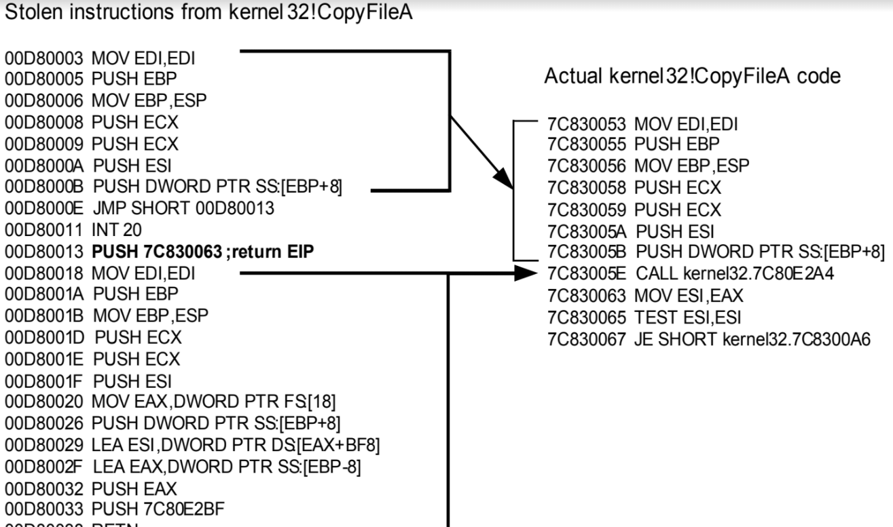  

Some packers also go as far as loading the whole DLL image in an allocated memory and then redirecting API calls into these DLL image copies. This technique effectively makes it difficult to set breakpoints in the actual APIs.  


## 6.6.  Multi-Threaded Packers  
With multi-threaded packers, another thread is usually spawned to perform some required operation such as decrypting the protected executable. With multi-thread packers, complexity is added and the difficulty of understanding the code increases since tracing the code gets complicated.  

One example of a multi-threaded packer is PECrypt, it uses a second thread to perform decryption of a data that had been fetched by the main thread, and these threads are synchronized using event objects.  

PECrypt operates and synchronizes its threads as follows:  
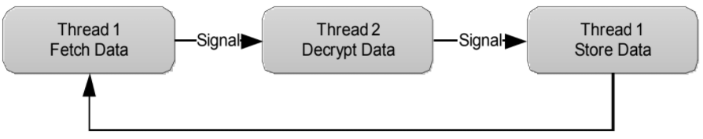  


## 6.7.  Virtual Machines  
The concept of using virtual machines is simple: a reverser will eventually figure out how to bypass/solve anti-debugging and anti-reversing techniques and that eventually, the protected executable needs to be decrypted and executed in memory leaving it vulnerable to static analysis.  

With the advent of virtual machines, protected parts of the code are translated into p-codes which are then translated into machine code for execution. Thus, the original machine instructions are replaced and the complexity of understanding what the code does exponentially increases.  

Below is a fairly simple illustration of the concept:  
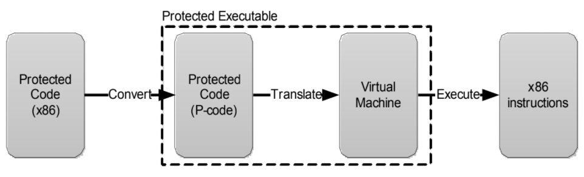  

Modern packers such as Oreans technologies’ CodeVirtualizer and StarForce apply the concept of virtual machines to protect executables.  

The solution for virtual machines, though not simple, is to analyze how the p-code is structured and translated by the virtual machine. And with the obtained information, a disassembler which will parse the p-code and translate them into machine code or understandable instructions can be developed.  

An example of developing a p-code disassembler and detailed information about implementation of virtual machines can be found on the following link:  
-  Defeating HyperUnpackMe2 With an IDA Processor Module, Rolf Rolles III http://www.openrce.org/articles/full_view/28


# 7.  Tools  
This section lists publicly available tools that reversers and malcode analysts can use to perform packer analysis and unpacking.  

Disclaimer: These tools are 3rd party tools; the author of this paper is not liable if any of these tools causes system instability or other issues that may impact your system. It is always advisable to run these tools in a test or a malware analysis environment.  


## 7.1.  OllyDbg  
http://www.ollydbg.de/  
A powerful ring 3 debugger; used by reversers and malcode analysts. Its plug-in capabilities allow other  reversers to create add- ons to make reversing  and unpacking much easier.  
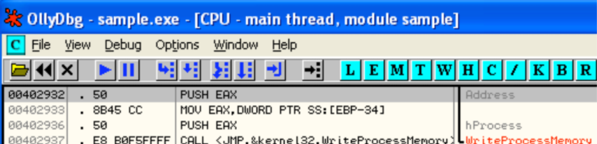  


## 7.2.  Ollyscript  
http://www.openrce.org/downloads/details/106/OllyScript  
An OllyDbg plug-in which allows automation of setting/handling breakpoints, patching code/data, etc. thru the use of a scripting language similar to assembly language. It’s most useful in performing repetitive tasks and automate unpacking.  
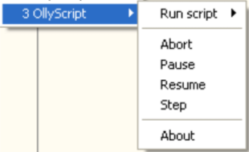  


## 7.3.  Olly Advanced  
http://www.openrce.org/downloads/details/241/Olly_Advanced   
If packers contain armoring code against reversers, this OllyDbg plug-in is the armor to the reverser’s debugger. It has several options to bypass several anti-debugging techniques and hide OllyDbg from packers detecting the debugger, and much more.  
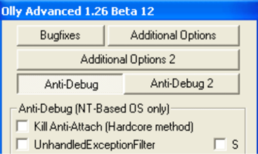  


## 7.4.  OllyDump
http://www.openrce.org/downloads/details/108/OllyDump  
After a successful unpack, this OllyDbg plug-in can be used for process dumping and import table rebuilding.  
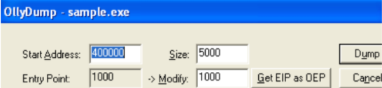  


## 7.5.  ImpRec  
http://www.woodmann.com/crackz/Unpackers/Imprec16.zip  
Finally, this is another tool for process dumping and import table rebuilding; it is a stand-alone tool, it offers one of the most excellent import table rebuilding capability.  
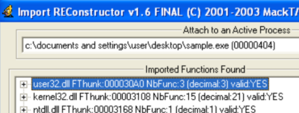  


# 8.  References  
**Books: Reverse Engineering, Software Protection**
-  Reversing: Secrets of Reverse Engineering. E.Eilam. Wiley, 2005.
-  Crackproof Your Software, P.Cerven, No Starch Press, 2002.

**Books: Windows and Processor Internals**
-  Microsoft Windows Internal, 4th Edition. M. Russinovich, D. Solomon, Microsoft Press, 2005
-  IA-32 Intel® Architecture Software Developer's Manual. Volume 1-3, Intel Corporation, 2006. http://www.intel.com/products/processor/manuals/index.htm  

**Links: Windows Internals**
-  ReactOS Project http://www.reactos.org/en/index.html  
    - Source Search: http://www.reactos.org/generated/doxygen/  
-  Wine Project http://www.winehq.org/  
    - Source Search: http://source.winehq.org/source/  
-  The Undocumented Functions http://undocumented.ntinternals.net  
-  MSDN http://msdn2.microsoft.com/en-us/default.aspx

**Links: Reverse Engineering, Software Protection, Unpacking**
-  OpenRCE http://www.openrce.org  
-  OpenRCE Anti Reverse Engineering Techniques Database http://www.openrce.org/reference_library/anti_reversing  
-  RCE Forums http://www.woodmann.com/forum/index.php  
-  EXETOOLS Forums http://forum.exetools.com  
